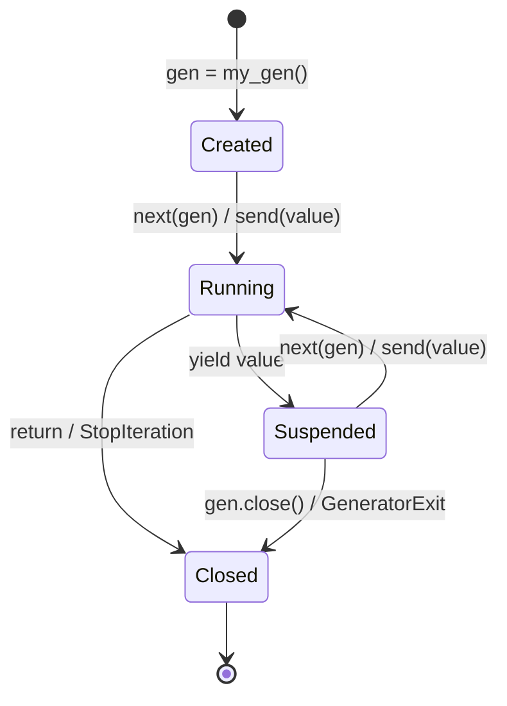

# :material-arrow-right-bold-circle: Generator Idiom

!!! abstract "At a Glance"
    **Intent / Purpose:** Produce a sequence of values lazily — on demand — without building the entire collection in memory.
    **C++ Equivalent:** `std::generator` (C++23), lazy ranges via `std::ranges::views`, coroutines with `co_yield`
    **Category:** Python Idiom / Lazy Evaluation

<div class="grid cards" markdown>
- :material-lightbulb-on: **Core Concept** — A function with `yield` pauses at each value and resumes on the next `next()` call
- :material-snake: **Python Way** — `yield`, `yield from`, generator expressions `(x for x in ...)`, and `itertools` pipelines
- :material-alert: **Watch Out** — Generators are single-pass; you cannot rewind or index into them without materialising to a list
- :material-check-circle: **When to Use** — Large or infinite sequences, streaming data, pipeline composition where the full dataset need not live in RAM simultaneously
</div>

---

## :material-lightbulb-on: Intuition

!!! info "Core Idea"
    A generator function looks like a regular function but uses `yield` instead of `return`. When called,
    it returns a *generator object* immediately — no code runs yet. Each call to `next()` on that object
    runs the function body until it hits `yield`, suspends (saving its entire local state), and hands the
    yielded value to the caller. The next `next()` resumes exactly where it left off.

    This is like a **ticket printer**: it prints one ticket at a time, on demand. It does not pre-print
    a million tickets and stack them up — it just prints the next one when you ask.

    ```python
    def count_up(start: int):
        n = start
        while True:
            yield n    # pause here, hand n to caller
            n += 1     # resume here on next next()

    counter = count_up(0)
    print(next(counter))   # 0
    print(next(counter))   # 1
    print(next(counter))   # 2
    ```

!!! success "Python vs C++"
    C++23 `std::generator<T>` achieves the same semantics via coroutines and `co_yield`. Before C++23,
    lazy ranges required `std::ranges::views::transform`, `filter`, `iota` etc. — composable but verbose
    and limited to range adaptors. Python generators are simpler: any function with `yield` becomes a
    coroutine, and `yield from` delegates to sub-generators, enabling arbitrarily deep pipeline composition
    with clean, readable syntax.

---

## :material-sitemap: Generator Lifecycle



---

## :material-book-open-variant: Implementation

### Infinite Fibonacci Generator

```python
from typing import Generator


def fibonacci() -> Generator[int, None, None]:
    """Infinite lazy Fibonacci sequence — never runs out of memory."""
    a, b = 0, 1
    while True:
        yield a
        a, b = b, a + b


# Take only as many as needed
def take(n: int, gen):
    for _ in range(n):
        yield next(gen)


fib = fibonacci()
print(list(take(10, fib)))
# [0, 1, 1, 2, 3, 5, 8, 13, 21, 34]

# Or use itertools.islice — idiomatic
from itertools import islice
print(list(islice(fibonacci(), 10)))
```

### Lazy File Reader — Line-by-Line Without Loading Entire File

```python
from pathlib import Path
from typing import Iterator


def read_lines(path: str | Path) -> Iterator[str]:
    """
    Yield lines one at a time. Even a 10 GB log file uses only one line of RAM.
    """
    with open(path, encoding="utf-8") as f:
        for line in f:
            yield line.rstrip("\n")


def read_chunks(path: str | Path, chunk_size: int = 8192) -> Iterator[bytes]:
    """Binary chunk reader for processing large files."""
    with open(path, "rb") as f:
        while chunk := f.read(chunk_size):
            yield chunk


# Usage: process a log file that is larger than available RAM
# for line in read_lines("/var/log/huge.log"):
#     if "ERROR" in line:
#         print(line)
```

### Generator Pipeline — Compose Lazy Transformations

```python
from typing import Iterator
import re


# Each stage is a generator — no intermediate lists
def read_log(path: str) -> Iterator[str]:
    with open(path) as f:
        yield from f          # yield from delegates to the file iterator


def grep(lines: Iterator[str], pattern: str) -> Iterator[str]:
    compiled = re.compile(pattern)
    for line in lines:
        if compiled.search(line):
            yield line


def parse_timestamp(lines: Iterator[str]) -> Iterator[dict]:
    ts_pattern = re.compile(r"(\d{4}-\d{2}-\d{2} \d{2}:\d{2}:\d{2})")
    for line in lines:
        m = ts_pattern.search(line)
        yield {"timestamp": m.group(1) if m else None, "raw": line.rstrip()}


def limit(items, n: int) -> Iterator:
    for i, item in enumerate(items):
        if i >= n:
            return
        yield item


# Build pipeline — nothing executes yet (fully lazy)
# pipeline = limit(parse_timestamp(grep(read_log("app.log"), "ERROR")), 10)
# for record in pipeline:
#     print(record)
```

### `yield from` — Delegating to Sub-Generators

```python
def flatten(nested) -> Iterator:
    """Recursively flatten an arbitrarily nested iterable."""
    for item in nested:
        if hasattr(item, "__iter__") and not isinstance(item, (str, bytes)):
            yield from flatten(item)   # delegate to sub-generator
        else:
            yield item


data = [1, [2, 3, [4, 5]], 6, [[7], 8]]
print(list(flatten(data)))   # [1, 2, 3, 4, 5, 6, 7, 8]


def chain(*iterables) -> Iterator:
    """Equivalent to itertools.chain."""
    for it in iterables:
        yield from it        # hands control to each iterable in turn


print(list(chain([1, 2], [3, 4], [5])))  # [1, 2, 3, 4, 5]
```

### Two-Way Communication with `send()` and `throw()`

```python
from typing import Generator


def accumulator() -> Generator[float, float, str]:
    """
    Receives numbers via .send(), yields running average.
    Returns a summary string when closed.
    """
    total   = 0.0
    count   = 0
    average = 0.0
    while True:
        try:
            value   = yield average      # yield current average, receive next value
            total  += value
            count  += 1
            average = total / count
        except GeneratorExit:
            return f"Final average: {average:.2f} over {count} values"


gen = accumulator()
next(gen)            # prime: run to first yield
print(gen.send(10))  # 10.0
print(gen.send(20))  # 15.0
print(gen.send(30))  # 20.0
gen.close()
```

### `itertools` Pipeline — Production-Grade Lazy Processing

```python
import itertools
import operator
from typing import Iterator


def process_data(records: Iterator[dict]) -> Iterator[dict]:
    """
    Chain of itertools operations — all lazy, no intermediate lists.
    """
    # Filter active records
    active = filter(lambda r: r.get("active"), records)

    # Transform: normalise scores to 0-100
    normalised = map(
        lambda r: {**r, "score": round(r["score"] * 100)},
        active,
    )

    # Group by category (requires sorted input)
    sorted_records = sorted(normalised, key=operator.itemgetter("category"))
    grouped = itertools.groupby(sorted_records, key=operator.itemgetter("category"))

    for category, items in grouped:
        group_items = list(items)
        avg_score   = sum(r["score"] for r in group_items) / len(group_items)
        yield {"category": category, "count": len(group_items), "avg_score": avg_score}


data = [
    {"category": "A", "score": 0.8, "active": True},
    {"category": "B", "score": 0.6, "active": True},
    {"category": "A", "score": 0.9, "active": True},
    {"category": "B", "score": 0.5, "active": False},  # filtered out
    {"category": "A", "score": 0.7, "active": True},
]

for summary in process_data(iter(data)):
    print(summary)
# {'category': 'A', 'count': 3, 'avg_score': 80.0}
# {'category': 'B', 'count': 1, 'avg_score': 60.0}
```

### Generator Expressions vs List Comprehensions

```python
import sys

data = range(1_000_000)

# List comprehension — allocates 1M integers immediately
list_comp = [x * 2 for x in data]
print(f"List:      {sys.getsizeof(list_comp):>12,} B")

# Generator expression — allocates ~200 bytes regardless of size
gen_expr  = (x * 2 for x in data)
print(f"Generator: {sys.getsizeof(gen_expr):>12,} B")

# Both iterate identically; generator cannot be indexed or rewound
total = sum(gen_expr)   # consumes the generator
```

---

## :material-alert: Common Pitfalls

!!! warning "Single-Pass Exhaustion"
    A generator is exhausted after one full iteration. Calling `list()` or `for` a second time yields
    nothing. If you need multiple passes, either materialise to a list or write a factory function:

    ```python
    # Bad: gen is exhausted after first use
    gen = (x**2 for x in range(10))
    print(sum(gen))    # 285
    print(sum(gen))    # 0 — already exhausted!

    # Good: call the factory each time
    def squares(): return (x**2 for x in range(10))
    print(sum(squares()))   # 285
    print(sum(squares()))   # 285
    ```

!!! warning "Forgetting to Prime a `send()`-Based Generator"
    Before calling `.send(value)`, you must advance the generator to its first `yield` with `next(gen)`
    or `gen.send(None)`. Skipping this raises `TypeError: can't send non-None value to a just-started generator`.

!!! danger "Resource Leaks When Not Closing Generators"
    If a generator opens a resource (file, DB connection) and you stop iterating early, Python eventually
    calls `close()` via GC, but timing is not guaranteed (especially with `PyPy` or reference cycles).
    Use generators as context managers or wrap them:

    ```python
    # Guaranteed cleanup with contextlib
    from contextlib import closing

    with closing(read_lines("huge.log")) as lines:
        for i, line in enumerate(lines):
            if i >= 100:
                break   # generator.close() called automatically on __exit__
    ```

!!! danger "RecursionError with `yield from` in Deep Structures"
    `yield from flatten(item)` is *not* tail-recursive — each recursive call adds a frame. For very deep
    nesting (thousands of levels), use an explicit stack:

    ```python
    def flatten_iterative(nested) -> Iterator:
        stack = [iter(nested)]
        while stack:
            try:
                item = next(stack[-1])
                if hasattr(item, "__iter__") and not isinstance(item, (str, bytes)):
                    stack.append(iter(item))
                else:
                    yield item
            except StopIteration:
                stack.pop()
    ```

---

## :material-help-circle: Flashcards

???+ question "What happens when Python encounters `yield` in a function body?"
    Python marks the function as a *generator function*. Calling it returns a **generator object** without
    executing any of the function body. The body only executes when `next()` is called on the generator
    object; execution proceeds until `yield`, at which point the yielded value is returned to the caller
    and the generator's frame (local variables, instruction pointer) is suspended.

???+ question "What does `yield from sub` do that a plain `for x in sub: yield x` loop cannot?"
    `yield from` establishes a two-way communication channel: values sent via `.send()` and exceptions
    thrown via `.throw()` are transparently forwarded into the sub-generator. A plain `for` loop only
    passes values outward; `send()` and `throw()` would be lost. `yield from` also propagates the
    `return` value of the sub-generator as the expression value of the `yield from`.

???+ question "How do generator expressions differ from list comprehensions in memory usage?"
    A **list comprehension** `[expr for x in it]` evaluates immediately and stores all results in a list
    in memory — O(n) space. A **generator expression** `(expr for x in it)` creates a generator object
    of constant size (~200 bytes) that produces one value at a time — O(1) space. Use generator
    expressions when you only need to iterate once and the collection may be large.

???+ question "Name three `itertools` functions that compose well with generators."
    - `itertools.islice(gen, n)` — take the first `n` values from a potentially infinite generator.
    - `itertools.chain(*iters)` — concatenate multiple iterables lazily.
    - `itertools.groupby(sorted_gen, key)` — group consecutive equal-key items (requires sorted input).
    - Bonus: `itertools.takewhile(pred, gen)` — yield values while predicate is true; `itertools.dropwhile` for the complement.

---

## :material-clipboard-check: Self Test

=== "Question 1"
    Write a generator `sliding_window(iterable, n)` that yields overlapping windows of size `n` as tuples.
    For `range(6)` and `n=3` it should yield `(0,1,2)`, `(1,2,3)`, `(2,3,4)`, `(3,4,5)`.

=== "Answer 1"
    ```python
    from collections import deque
    from typing import Iterator, Iterable, TypeVar

    T = TypeVar("T")

    def sliding_window(iterable: Iterable[T], n: int) -> Iterator[tuple]:
        it     = iter(iterable)
        window = deque(islice(it, n), maxlen=n)
        if len(window) == n:
            yield tuple(window)
        for item in it:
            window.append(item)
            yield tuple(window)

    from itertools import islice
    print(list(sliding_window(range(6), 3)))
    # [(0, 1, 2), (1, 2, 3), (2, 3, 4), (3, 4, 5)]
    ```
    The `deque(maxlen=n)` automatically discards the oldest element when a new one is appended,
    making the window update O(1) per step.

=== "Question 2"
    A pipeline reads log lines, keeps only `WARNING` and `ERROR` lines, strips timestamps, and yields
    the first 50 results. Write this as a composed generator pipeline without any intermediate lists.

=== "Answer 2"
    ```python
    import re
    from itertools import islice
    from typing import Iterator

    TS_RE = re.compile(r"^\d{4}-\d{2}-\d{2} \d{2}:\d{2}:\d{2} ")

    def read_log_lines(path: str) -> Iterator[str]:
        with open(path) as f:
            yield from f

    def filter_severity(lines: Iterator[str], *levels: str) -> Iterator[str]:
        for line in lines:
            if any(lvl in line for lvl in levels):
                yield line

    def strip_timestamp(lines: Iterator[str]) -> Iterator[str]:
        for line in lines:
            yield TS_RE.sub("", line).rstrip()

    # Fully lazy pipeline — only 50 lines ever leave the file buffer
    # pipeline = islice(
    #     strip_timestamp(
    #         filter_severity(
    #             read_log_lines("app.log"),
    #             "WARNING", "ERROR",
    #         )
    #     ),
    #     50,
    # )
    # results = list(pipeline)
    ```

---

## :material-check-circle: Summary

!!! success "Key Takeaways"
    - **Generators = lazy evaluation.** `yield` pauses execution and saves local state; `next()` resumes it.
    - Generator expressions are O(1) memory; list comprehensions are O(n). Prefer generators for large or infinite sequences.
    - `yield from sub` delegates to a sub-generator transparently, including `send()` and `throw()` forwarding.
    - Compose generators into **pipelines** — each stage is a generator that pulls from the previous stage on demand; no intermediate lists needed.
    - Generators are **single-pass**; materialise to a list if you need multiple iterations.
    - `itertools` (`islice`, `chain`, `groupby`, `takewhile`) provides production-grade lazy building blocks.
    - Resource-owning generators should be wrapped with `contextlib.closing` or a `with` statement to guarantee cleanup.
