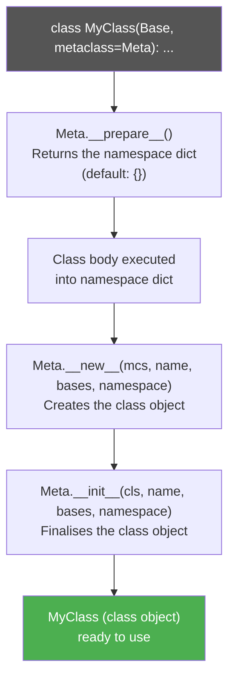

# :material-dna: Metaclass Idiom

!!! abstract "At a Glance"
    **Intent / Purpose:** Control class creation — enforce constraints, auto-register subclasses, implement singletons, or inject attributes at class definition time.
    **C++ Equivalent:** CRTP (Curiously Recurring Template Pattern), template metaprogramming, static class members with virtual dispatch
    **Category:** Python Idiom / Metaprogramming

<div class="grid cards" markdown>
- :material-lightbulb-on: **Core Concept** — A metaclass is the *class of a class*; `type` is the default metaclass for every Python class
- :material-snake: **Python Way** — `class Foo(metaclass=MyMeta)` or the lighter `__init_subclass__` hook for most use cases
- :material-alert: **Watch Out** — Metaclass conflicts when two base classes use different metaclasses cause `TypeError` at class definition time
- :material-check-circle: **When to Use** — Framework infrastructure (ORM fields, plugin registration, singletons); prefer `__init_subclass__` for simpler needs
</div>

---

## :material-lightbulb-on: Intuition

!!! info "Core Idea"
    In Python, everything is an object — including classes. If `int` is an instance of `type`, and
    `type` is itself a class, then `type` is the *metaclass* of `int`. When Python executes `class Foo: ...`,
    it calls `type.__call__` which calls `type.__new__` (creates the class object) then `type.__init__`
    (initialises it). A custom metaclass intercepts these steps.

    Think of a metaclass as a **class factory with hooks**:

    ```
    class Foo(Base, metaclass=Meta):
        x = 1
    ```
    is roughly equivalent to:
    ```python
    Foo = Meta("Foo", (Base,), {"x": 1})
    ```

    You define a metaclass when you want code that runs **at class definition time** (not at instance
    creation time) and that inspects or modifies the class namespace before the class object is finalised.

!!! success "Python vs C++"
    C++ achieves compile-time class manipulation via CRTP and template specialisation — powerful but
    syntactically heavy and limited to what the compiler can evaluate. Python metaclasses run at import
    time with full runtime Python expressiveness: you can read configuration files, connect to databases,
    or dynamically generate methods. The trade-off is that Python metaclass errors surface at import
    time, which can be surprising if you are used to runtime-only errors.

---

## :material-sitemap: Class Creation Pipeline



---

## :material-book-open-variant: Implementation

### Understanding `type` Directly

```python
# Every class you write is an instance of type
print(type(int))    # <class 'type'>
print(type(str))    # <class 'type'>

class Dog:
    legs = 4

print(type(Dog))    # <class 'type'>

# You can create classes dynamically with type(name, bases, dict)
Cat = type("Cat", (object,), {"legs": 4, "sound": "meow"})
print(Cat.legs)     # 4
print(Cat().sound)  # meow
```

### Singleton Metaclass

```python
import threading


class SingletonMeta(type):
    """Thread-safe singleton: only one instance per class."""

    _instances: dict[type, object] = {}
    _lock = threading.Lock()

    def __call__(cls, *args, **kwargs):
        # Double-checked locking
        if cls not in cls._instances:
            with cls._lock:
                if cls not in cls._instances:
                    instance = super().__call__(*args, **kwargs)
                    cls._instances[cls] = instance
        return cls._instances[cls]


class DatabaseConnection(metaclass=SingletonMeta):
    def __init__(self, url: str) -> None:
        self.url = url
        print(f"[DB] Connecting to {url}")


db1 = DatabaseConnection("postgresql://localhost/mydb")
db2 = DatabaseConnection("postgresql://localhost/mydb")
print(db1 is db2)    # True — same instance


class AppConfig(metaclass=SingletonMeta):
    def __init__(self) -> None:
        self.debug = False


cfg1 = AppConfig()
cfg2 = AppConfig()
print(cfg1 is cfg2)  # True
```

### Registry Metaclass — Auto-Register Subclasses

```python
from __future__ import annotations


class PluginMeta(type):
    """Any class using this metaclass is automatically added to the registry."""

    _registry: dict[str, type] = {}

    def __new__(mcs, name, bases, namespace):
        cls = super().__new__(mcs, name, bases, namespace)
        # Don't register the abstract base itself
        if bases:
            key = namespace.get("plugin_name", name.lower())
            mcs._registry[key] = cls
            print(f"[PluginMeta] Registered '{key}' → {cls.__qualname__}")
        return cls

    @classmethod
    def get_plugin(mcs, name: str) -> type:
        try:
            return mcs._registry[name]
        except KeyError:
            raise KeyError(f"Unknown plugin: {name!r}. "
                           f"Available: {list(mcs._registry)}")


class BasePlugin(metaclass=PluginMeta):
    """Abstract base — not registered."""
    def run(self) -> str: ...


class JsonPlugin(BasePlugin):
    plugin_name = "json"
    def run(self) -> str: return "Processing JSON"


class XmlPlugin(BasePlugin):
    plugin_name = "xml"
    def run(self) -> str: return "Processing XML"


class CsvPlugin(BasePlugin):
    # no plugin_name → uses class name lowercased
    def run(self) -> str: return "Processing CSV"


# Dynamic dispatch based on config/user input
for name in ["json", "xml", "csvplugin"]:
    try:
        plugin_cls = PluginMeta.get_plugin(name)
        print(plugin_cls().run())
    except KeyError as e:
        print(e)
```

### Enforcing Constraints at Class Definition Time

```python
class InterfaceMeta(type):
    """Enforce that subclasses implement all abstract methods."""

    def __new__(mcs, name, bases, namespace):
        cls = super().__new__(mcs, name, bases, namespace)
        # Collect required methods from any base that sets _required_methods
        required: set[str] = set()
        for base in bases:
            required |= getattr(base, "_required_methods", set())

        if required and bases:
            missing = required - set(namespace)
            if missing:
                raise TypeError(
                    f"Class {name!r} must implement: {sorted(missing)}"
                )
        return cls


class Serializable(metaclass=InterfaceMeta):
    _required_methods = {"serialize", "deserialize"}

    def serialize(self) -> str: ...
    def deserialize(self, data: str) -> None: ...


class JsonSerializer(Serializable):
    def serialize(self) -> str:
        return "{}"
    def deserialize(self, data: str) -> None:
        pass   # valid


# This would raise TypeError at class definition time:
# class BrokenSerializer(Serializable):
#     def serialize(self) -> str: return "{}"
#     # missing deserialize → TypeError: Class 'BrokenSerializer' must implement: ['deserialize']
```

### `__init_subclass__` — The Lighter Alternative

```python
class BaseSerializer:
    """
    __init_subclass__ is called automatically on every direct or indirect subclass.
    It is simpler than a metaclass for the common case of inspecting subclasses.
    """

    _registry: dict[str, type] = {}

    def __init_subclass__(cls, format: str | None = None, **kwargs) -> None:
        super().__init_subclass__(**kwargs)
        if format is not None:
            BaseSerializer._registry[format] = cls
            print(f"[Registry] {format!r} → {cls.__name__}")

    @classmethod
    def for_format(cls, format: str) -> type:
        return cls._registry[format]


class JsonSerializer(BaseSerializer, format="json"):
    def dumps(self, obj) -> str: return str(obj)


class YamlSerializer(BaseSerializer, format="yaml"):
    def dumps(self, obj) -> str: return f"yaml: {obj}"


class PickleSerializer(BaseSerializer, format="pickle"):
    def dumps(self, obj) -> bytes: return b"..."


ser_cls = BaseSerializer.for_format("json")
print(ser_cls().dumps({"key": "value"}))
```

---

## :material-alert: Common Pitfalls

!!! warning "Metaclass Conflicts"
    If class `A` uses `MetaA` and class `B` uses `MetaB`, a class `C(A, B)` causes a `TypeError`
    because Python cannot determine which metaclass to use. Resolve by creating a combined metaclass:

    ```python
    class CombinedMeta(MetaA, MetaB): pass

    class C(A, B, metaclass=CombinedMeta): pass
    ```

!!! warning "Prefer `__init_subclass__` for Simple Registration"
    Before reaching for a metaclass, ask: "Can `__init_subclass__` do this?" It was added in Python 3.6
    precisely to handle auto-registration and constraint-checking without the metaclass boilerplate.
    Only use a full metaclass when you need `__prepare__` (custom namespace), or to intercept `__call__`
    (Singleton), or for deep framework-level control.

!!! danger "Metaclass `__init__` Runs on Every Subclass"
    Code in `Meta.__init__` runs each time a class using that metaclass is *defined* — including every
    subclass. If that code has side effects (DB writes, network calls), you'll trigger them for every
    class definition. Guard with `if bases:` to skip the base class itself.

!!! danger "Modifying `__dict__` After `__new__`"
    The class `__dict__` returned by `__new__` is a `mappingproxy` — immutable. To add or remove
    attributes after class creation, use `setattr(cls, name, value)` instead of `cls.__dict__[name] = value`.

---

## :material-help-circle: Flashcards

???+ question "What is a metaclass in Python, and what is the default metaclass?"
    A metaclass is the class of a class — it controls how class objects are created and initialised.
    The default metaclass is `type`. Every class you define with `class Foo: ...` is an instance of `type`
    unless you specify `metaclass=MyMeta`.

???+ question "What are the four dunder methods a metaclass can define, and when does each run?"
    1. `__prepare__(mcs, name, bases)` — called *before* the class body is executed; returns the namespace dict (e.g., an `OrderedDict`).
    2. `__new__(mcs, name, bases, namespace)` — creates and returns the class object.
    3. `__init__(cls, name, bases, namespace)` — initialises the already-created class object.
    4. `__call__(cls, *args, **kwargs)` — called when the *class* is called to create an instance; intercepting this enables Singleton.

???+ question "Why is `__init_subclass__` usually preferable to a metaclass for auto-registration?"
    `__init_subclass__` is a regular classmethod on the base class, not a separate metaclass object. It
    has no metaclass conflict risk, requires no `metaclass=` keyword on subclasses, and its `**kwargs`
    mechanism allows passing configuration parameters directly in the `class` statement
    (e.g., `class Foo(Base, format="json")`). It is simpler, more discoverable, and sufficient for most
    auto-registration and constraint-checking needs.

???+ question "How does the double-checked locking pattern make `SingletonMeta` thread-safe?"
    The outer `if cls not in cls._instances` check avoids acquiring the lock on every call (fast path).
    The inner check inside `with cls._lock` guarantees that only one thread creates the instance even
    if two threads pass the outer check simultaneously before either acquires the lock.

---

## :material-clipboard-check: Self Test

=== "Question 1"
    Write a metaclass `ValidatedMeta` that raises `TypeError` at class definition time if a class defines
    a method named `process` but its signature does not include a `timeout: float` parameter.

=== "Answer 1"
    ```python
    import inspect

    class ValidatedMeta(type):
        def __new__(mcs, name, bases, namespace):
            cls = super().__new__(mcs, name, bases, namespace)
            process = namespace.get("process")
            if callable(process):
                params = inspect.signature(process).parameters
                if "timeout" not in params:
                    raise TypeError(
                        f"{name}.process() must declare a 'timeout: float' parameter"
                    )
            return cls

    class Worker(metaclass=ValidatedMeta):
        def process(self, data: str, timeout: float) -> None:
            pass   # valid

    # This would raise TypeError:
    # class BrokenWorker(metaclass=ValidatedMeta):
    #     def process(self, data: str) -> None:  # missing timeout
    #         pass
    ```

=== "Question 2"
    Rewrite the `PluginMeta` registry using `__init_subclass__` instead of a metaclass. What changes?

=== "Answer 2"
    ```python
    class BasePlugin:
        _registry: dict[str, type] = {}

        def __init_subclass__(cls, plugin_name: str | None = None, **kwargs) -> None:
            super().__init_subclass__(**kwargs)
            name = plugin_name or cls.__name__.lower()
            BasePlugin._registry[name] = cls

        @classmethod
        def get_plugin(cls, name: str) -> type:
            return cls._registry[name]

        def run(self) -> str: ...


    class JsonPlugin(BasePlugin, plugin_name="json"):
        def run(self) -> str: return "Processing JSON"

    class XmlPlugin(BasePlugin, plugin_name="xml"):
        def run(self) -> str: return "Processing XML"

    print(BasePlugin.get_plugin("json")().run())
    ```

    **What changes:**
    - No separate metaclass file or `metaclass=` keyword.
    - `plugin_name` is now a keyword argument to the `class` statement.
    - No risk of metaclass conflicts if `BasePlugin` or its subclasses also inherit from third-party classes.
    - The `_registry` lives on `BasePlugin` itself, not on a metaclass object.

---

## :material-check-circle: Summary

!!! success "Key Takeaways"
    - A metaclass is the class of a class; `type` is Python's default metaclass.
    - `type(name, bases, namespace)` is how Python creates every class — a custom metaclass intercepts this pipeline.
    - Key use cases: **Singleton** (intercept `__call__`), **plugin registry** (inspect subclasses in `__new__`), **constraint enforcement** (validate namespace in `__new__`).
    - **Prefer `__init_subclass__`** for auto-registration and lightweight constraints — it is simpler, conflict-free, and Python 3.6+.
    - Reach for a full metaclass only when you need `__prepare__`, `__call__` interception, or deep framework control (e.g., Django ORM model fields).
    - Always guard metaclass `__init__`/`__new__` with `if bases:` to skip the abstract base class itself.
