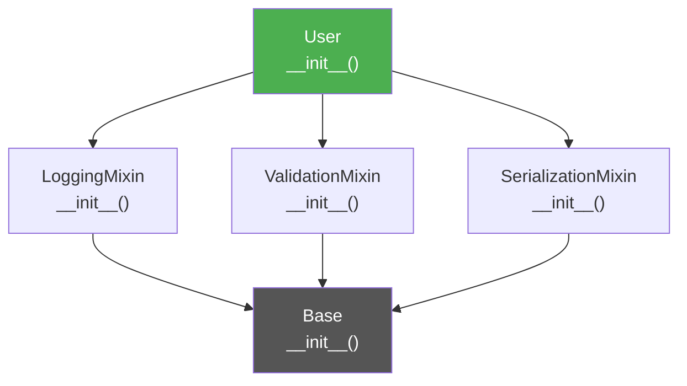

# :material-set-merge: Mixin Idiom

!!! abstract "At a Glance"
    **Intent / Purpose:** Add reusable behaviour to classes through multiple inheritance without creating deep or tangled class hierarchies.
    **C++ Equivalent:** CRTP (Curiously Recurring Template Pattern), multiple inheritance with policy classes, `std::enable_if` traits
    **Category:** Python Idiom / Composition via Inheritance

<div class="grid cards" markdown>
- :material-lightbulb-on: **Core Concept** — A mixin is a class that provides methods but is not meant to be instantiated on its own
- :material-snake: **Python Way** — Multiple inheritance + MRO C3 linearization + cooperative `super()` makes mixins compose safely
- :material-alert: **Watch Out** — Mixin method name collisions silently shadow each other; always verify MRO order
- :material-check-circle: **When to Use** — Cross-cutting concerns (logging, validation, serialisation) that many unrelated classes need
</div>

---

## :material-lightbulb-on: Intuition

!!! info "Core Idea"
    Imagine you are building a Django-like framework. You have `User`, `Product`, and `Order` classes.
    All three need logging of every method call. All three need JSON serialisation. Some need validation.
    You *could* copy-paste those methods into each class, or create a deep inheritance chain — both are
    maintenance nightmares. **Mixins** solve this by letting you write the behaviour once and *mix it in*:

    ```python
    class User(LoggingMixin, ValidationMixin, SerializationMixin, Base):
        ...
    ```

    Each mixin brings one orthogonal capability. `User` inherits the behaviour without knowing how each
    mixin is implemented. Adding `TimestampMixin` later requires touching only one line.

!!! success "Python vs C++"
    In C++, CRTP achieves zero-overhead mixin-like behaviour by letting the base class call the derived
    class's methods via templates. It is powerful but syntactically awkward and limited to compile-time
    polymorphism. Python's cooperative `super()` and the C3 MRO algorithm make runtime multiple
    inheritance safe and predictable — the call chain threads through every class in MRO order,
    and each `super()` call automatically finds the *next* class in that chain.

---

## :material-sitemap: MRO Diamond Resolution



MRO for `User(LoggingMixin, ValidationMixin, SerializationMixin, Base)`:
`User → LoggingMixin → ValidationMixin → SerializationMixin → Base → object`

---

## :material-book-open-variant: Implementation

### Three Mixins + One Domain Class

```python
from __future__ import annotations
import json
import logging
from datetime import datetime
from typing import Any


# ── Mixin 1: Logging ──────────────────────────────────────────────────────────
class LoggingMixin:
    """
    Adds a per-class logger and a log_action() convenience method.
    Uses cooperative super() so it composes cleanly with other mixins.
    """

    def __init_subclass__(cls, **kwargs) -> None:
        super().__init_subclass__(**kwargs)
        cls._logger = logging.getLogger(cls.__qualname__)

    def log_action(self, action: str, **context) -> None:
        self._logger.info("%s | %s | %s", type(self).__name__, action, context)

    def __repr__(self) -> str:
        # Mixins should not override __repr__ blindly — use getattr with fallback
        base = super().__repr__()
        return f"[Logged]{base}"


# ── Mixin 2: Validation ───────────────────────────────────────────────────────
class ValidationMixin:
    """
    Defines a validate() hook that subclasses override.
    Calls validate() automatically in __init__ via cooperative super().
    """

    def __init__(self, *args, **kwargs) -> None:
        super().__init__(*args, **kwargs)   # cooperative: continues up the MRO
        self.validate()

    def validate(self) -> None:
        """Override in subclass to add field-level constraints."""
        pass

    def _require(self, condition: bool, message: str) -> None:
        if not condition:
            raise ValueError(message)


# ── Mixin 3: Serialisation ────────────────────────────────────────────────────
class SerializationMixin:
    """Adds to_json() / from_json() based on instance __dict__."""

    def to_dict(self) -> dict[str, Any]:
        return {
            k: v for k, v in self.__dict__.items()
            if not k.startswith("_")
        }

    def to_json(self, indent: int = 2) -> str:
        return json.dumps(self.to_dict(), indent=indent, default=str)

    @classmethod
    def from_dict(cls, data: dict[str, Any]) -> SerializationMixin:
        instance = cls.__new__(cls)
        instance.__dict__.update(data)
        return instance

    @classmethod
    def from_json(cls, raw: str) -> SerializationMixin:
        return cls.from_dict(json.loads(raw))


# ── Base domain class ─────────────────────────────────────────────────────────
class Entity:
    """Minimal base for all domain objects."""

    def __init__(self, entity_id: int) -> None:
        self.entity_id = entity_id
        self.created_at = datetime.utcnow().isoformat()

    def __repr__(self) -> str:
        return f"{type(self).__name__}(id={self.entity_id})"


# ── Composed domain class ─────────────────────────────────────────────────────
class User(LoggingMixin, ValidationMixin, SerializationMixin, Entity):
    """
    MRO: User → LoggingMixin → ValidationMixin → SerializationMixin → Entity → object
    Each __init__ calls super().__init__() so all initialisers run in MRO order.
    """

    def __init__(self, entity_id: int, username: str, email: str, age: int) -> None:
        self.username = username
        self.email    = email
        self.age      = age
        super().__init__(entity_id)   # cooperative — triggers ValidationMixin.__init__

    def validate(self) -> None:
        self._require(len(self.username) >= 3, "Username must be at least 3 characters")
        self._require("@" in self.email,       "Invalid email address")
        self._require(self.age >= 0,           "Age cannot be negative")

    def save(self) -> None:
        self.log_action("save", username=self.username)
        print(f"Saving {self.username} to database...")


# ── Usage ─────────────────────────────────────────────────────────────────────
if __name__ == "__main__":
    logging.basicConfig(level=logging.INFO)

    user = User(42, "alice", "alice@example.com", 30)
    user.save()

    print(user.to_json())
    # {
    #   "username": "alice",
    #   "email": "alice@example.com",
    #   "age": 30,
    #   "entity_id": 42,
    #   "created_at": "..."
    # }

    # Reconstruct from JSON
    raw   = user.to_json()
    user2 = User.from_json(raw)
    print(user2.to_dict())

    # Validation failure
    try:
        bad = User(99, "x", "not-an-email", -1)
    except ValueError as e:
        print(f"Validation error: {e}")
```

### Demonstrating MRO with `__mro__`

```python
print(User.__mro__)
# (<class 'User'>, <class 'LoggingMixin'>, <class 'ValidationMixin'>,
#  <class 'SerializationMixin'>, <class 'Entity'>, <class 'object'>)

# You can also inspect the MRO resolution programmatically
for i, cls in enumerate(User.__mro__):
    print(f"  {i}: {cls.__name__}")
```

### Cooperative `super()` Call Chain

```python
class A:
    def greet(self) -> str:
        return "A"

class B(A):
    def greet(self) -> str:
        return "B → " + super().greet()

class C(A):
    def greet(self) -> str:
        return "C → " + super().greet()

class D(B, C):
    def greet(self) -> str:
        return "D → " + super().greet()

# MRO: D → B → C → A → object
# super() in B calls C.greet (not A.greet!), because C comes next in D's MRO
d = D()
print(d.greet())   # D → B → C → A

# Verify
print([cls.__name__ for cls in D.__mro__])
# ['D', 'B', 'C', 'A', 'object']
```

### Timestamp Mixin — Adding a Cross-Cutting Concern Later

```python
class TimestampMixin:
    """Auto-record created_at and updated_at on any class."""

    def __init__(self, *args, **kwargs) -> None:
        super().__init__(*args, **kwargs)
        now = datetime.utcnow().isoformat()
        if not hasattr(self, "created_at"):
            self.created_at = now
        self.updated_at = now

    def touch(self) -> None:
        self.updated_at = datetime.utcnow().isoformat()


class AuditedUser(TimestampMixin, LoggingMixin, ValidationMixin, SerializationMixin, Entity):
    def __init__(self, entity_id: int, username: str, email: str, age: int) -> None:
        self.username = username
        self.email    = email
        self.age      = age
        super().__init__(entity_id)

    def validate(self) -> None:
        self._require("@" in self.email, "Invalid email")


au = AuditedUser(1, "bob", "bob@example.com", 25)
print(au.to_json())
au.touch()
print(f"Updated at: {au.updated_at}")
```

---

## :material-alert: Common Pitfalls

!!! warning "Non-Cooperative `super()` Breaks the Chain"
    If any class in the MRO calls `__init__` directly (`Base.__init__(self, ...)`) instead of
    `super().__init__(...)`, it short-circuits the cooperative chain and mixins after that point are
    never initialised:

    ```python
    class BrokenMixin:
        def __init__(self, *args, **kwargs):
            object.__init__(self)   # WRONG — skips everything between this and object
    ```
    Always use `super().__init__(*args, **kwargs)` and pass through unknown `**kwargs`.

!!! warning "Silent Method Shadowing"
    If two mixins define a method with the same name, the one that appears first in the MRO wins.
    The second's method is silently unreachable. Use `__mro__` inspection or a linting tool to detect
    collisions before they cause subtle bugs.

!!! danger "Mixins with Incompatible `__init__` Signatures"
    If `LoggingMixin.__init__` accepts `(name)` and `ValidationMixin.__init__` accepts `(email)`,
    the `super()` chain breaks when arguments do not match. Use `*args, **kwargs` pass-through in
    every mixin `__init__` and reserve specific parameters for the concrete class:

    ```python
    class SafeMixin:
        def __init__(self, *args, **kwargs) -> None:
            super().__init__(*args, **kwargs)   # pass everything onward
    ```

!!! danger "Inheriting from a Mixin Alone"
    A mixin should never be instantiated directly. Enforce this by having mixins raise `TypeError`
    if instantiated without a proper base, or document the convention clearly. Some teams suffix mixin
    class names with `Mixin` to make the intent obvious.

---

## :material-help-circle: Flashcards

???+ question "What is the C3 linearization algorithm, and why does Python use it?"
    C3 linearization computes a consistent, deterministic MRO for classes with multiple inheritance.
    It guarantees three properties: (1) a class always appears before its parents, (2) the left-to-right
    order of base classes in the `class` statement is preserved, and (3) the MRO of every parent class
    is respected as a subsequence. Python uses C3 (since Python 2.3) because it eliminates the
    inconsistent orderings that plagued the old depth-first left-to-right algorithm.

???+ question "Why must mixin `__init__` methods use `super().__init__(*args, **kwargs)`?"
    Because in a multiple-inheritance hierarchy, `super()` does not call the direct superclass — it calls
    the *next class in the MRO*. If a mixin hard-codes `object.__init__(self)`, it breaks the cooperative
    chain and all mixins after it in the MRO never run their `__init__`. Using `super().__init__(*args, **kwargs)`
    ensures every class in the chain gets initialised.

???+ question "How do you find out which class's method wins when two mixins define the same name?"
    Check `ClassName.__mro__` — the first class in the list that defines the method wins. You can also
    call `ClassName.method_name` and inspect `.__qualname__` or use `inspect.getmembers()`.

???+ question "What is the difference between a mixin and a regular base class?"
    A **mixin** provides a specific, bounded capability (logging, serialisation) that is orthogonal to
    the domain. It is typically stateless (or adds only auxiliary state), is never instantiated alone,
    and is designed to compose with many unrelated classes. A **base class** defines the core identity
    and state of a class hierarchy and is meant to be the primary parent.

---

## :material-clipboard-check: Self Test

=== "Question 1"
    Given `class X(A, B, C)` where `A(Base)`, `B(Base)`, `C(Base)`, and `Base(object)`, write out
    the MRO using C3 rules. Then show which class's `greet()` is called at each step when `X().greet()`
    uses cooperative `super()`.

=== "Answer 1"
    C3 MRO for `X(A, B, C)`:
    `X → A → B → C → Base → object`

    If all classes implement `greet()` cooperatively:
    ```
    X.greet()    → calls super().greet() → A.greet()
    A.greet()    → calls super().greet() → B.greet()
    B.greet()    → calls super().greet() → C.greet()
    C.greet()    → calls super().greet() → Base.greet()
    Base.greet() → calls super().greet() → object  (no greet on object, chain ends)
    ```

    Result string (if each prepends its name): `"X → A → B → C → Base"`

=== "Question 2"
    You want to add a `CachingMixin` that caches the return value of any method decorated with
    `@cached_method`. Sketch the mixin using a simple `dict` cache, and explain one limitation.

=== "Answer 2"
    ```python
    import functools
    from typing import Callable, TypeVar

    F = TypeVar("F", bound=Callable)

    def cached_method(method: F) -> F:
        cache_attr = f"_cache_{method.__name__}"

        @functools.wraps(method)
        def wrapper(self, *args, **kwargs):
            if not hasattr(self, cache_attr):
                object.__setattr__(self, cache_attr, {})
            cache = getattr(self, cache_attr)
            key = (args, tuple(sorted(kwargs.items())))
            if key not in cache:
                cache[key] = method(self, *args, **kwargs)
            return cache[key]

        return wrapper  # type: ignore


    class CachingMixin:
        def clear_cache(self, method_name: str | None = None) -> None:
            if method_name:
                setattr(self, f"_cache_{method_name}", {})
            else:
                for attr in list(vars(self)):
                    if attr.startswith("_cache_"):
                        delattr(self, attr)


    class ExpensiveComputer(CachingMixin):
        @cached_method
        def compute(self, n: int) -> int:
            print(f"  Computing for n={n}...")
            return sum(range(n))

    ec = ExpensiveComputer()
    print(ec.compute(1000))   # computes
    print(ec.compute(1000))   # cache hit — no print
    ```

    **Limitation:** The cache is per-instance but never automatically invalidated. If the computed
    result depends on mutable state that changes, stale cache values are returned silently. Also,
    unhashable arguments (lists, dicts) raise `TypeError` on cache key creation.

---

## :material-check-circle: Summary

!!! success "Key Takeaways"
    - **Mixins add orthogonal behaviour** (logging, validation, serialisation) to classes without deep inheritance.
    - Python's **C3 MRO** produces a consistent, deterministic method resolution order for multiple inheritance.
    - **Cooperative `super()`** threads `__init__` and other method calls through every class in the MRO — never skip it.
    - Every mixin `__init__` must accept and forward `*args, **kwargs` to keep the cooperative chain intact.
    - Inspect `ClassName.__mro__` to understand and debug method resolution.
    - Suffix mixin classes with `Mixin` by convention; never instantiate them directly.
    - For cross-cutting concerns that affect many unrelated classes, mixins beat both copy-paste and deep single-inheritance chains.
