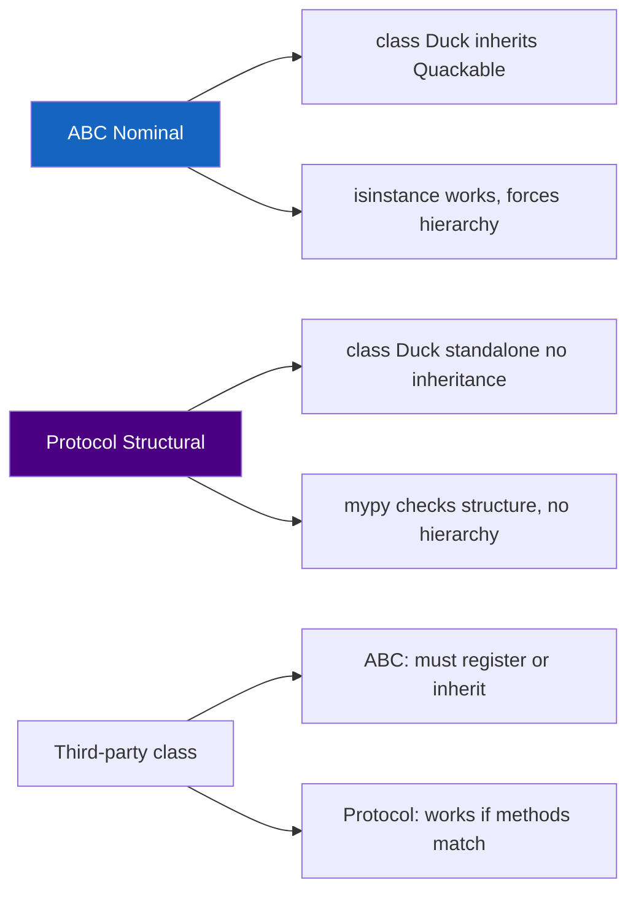

# :material-duck: Protocol Idiom

!!! abstract "At a Glance"
    **Goal:** Define structural interfaces that any matching class satisfies, without inheritance.
    **C++ Equivalent:** C++20 Concepts — structural constraints checked at compile time.

<div class="grid cards" markdown>

- :material-lightbulb-on: **Core Concept** — Structural subtyping: "if it has the right methods, it conforms"
- :material-snake: **Python Way** — `typing.Protocol` (PEP 544) — no inheritance required
- :material-alert: **Watch Out** — Runtime `isinstance` check is shallow (method name only, not signature)
- :material-check-circle: **When to Use** — Library APIs, functions accepting many unrelated types

</div>

## :material-lightbulb-on: Intuition

!!! info "Core Idea"
    C++20 Concepts constrain template parameters structurally at compile time. Python's `Protocol`
    is the runtime/static equivalent: any class that has the required attributes and methods
    satisfies the Protocol — without needing to inherit from it. Static type checkers (mypy, pyright)
    verify conformance at analysis time.

!!! success "Structural vs Nominal Subtyping"
    | Approach | Mechanism | Must inherit? | `isinstance` works? |
    |---|---|---|---|
    | **Nominal** (ABC) | `class Foo(MyABC)` | Yes | Always |
    | **Structural** (Protocol) | Has matching methods | No | Only with `@runtime_checkable` |
    | **Duck typing** | Just call the method | No | N/A |

## :material-chart-timeline: Structural vs Nominal Subtyping



## :material-book-open-variant: Defining and Using Protocols

```python
from typing import Protocol, runtime_checkable

class Drawable(Protocol):
    def draw(self) -> None: ...

class Resizable(Protocol):
    def resize(self, width: int, height: int) -> None: ...

    @property
    def dimensions(self) -> tuple[int, int]: ...

# Protocol composition
class Widget(Drawable, Resizable, Protocol):
    """A Widget is both Drawable and Resizable."""
    ...

# Classes satisfying Drawable — NO inheritance needed!
class Circle:
    def __init__(self, r: float) -> None:
        self.r = r

    def draw(self) -> None:
        print(f"Drawing circle r={self.r}")

class Button:
    def __init__(self, label: str) -> None:
        self.label = label

    def draw(self) -> None:
        print(f"Drawing button: {self.label}")

def render_all(items: list[Drawable]) -> None:
    for item in items:
        item.draw()

render_all([Circle(5), Button("OK")])   # works! mypy happy
```

## :material-code-tags: `@runtime_checkable`

```python
@runtime_checkable
class Closeable(Protocol):
    def close(self) -> None: ...

@runtime_checkable
class Sized(Protocol):
    def __len__(self) -> int: ...

print(isinstance([1, 2, 3], Sized))     # True
print(isinstance(42, Sized))            # False — int has no __len__

# Pitfall: only checks attribute NAME presence, not callability or signature
class Trick:
    close = "not a function"   # attribute named close but it is a string!

print(isinstance(Trick(), Closeable))  # True — shallow name check only!
```

!!! warning "Runtime checks are shallow"
    `isinstance(obj, MyProtocol)` only checks that required **attribute names exist**.
    It does not verify callability, signature, or return type. Rely on the static type
    checker for full structural validation.

## :material-library: `collections.abc` Protocols

```python
from collections.abc import (
    Iterable,     # __iter__
    Iterator,     # __iter__ + __next__
    Sequence,     # __getitem__ + __len__
    Mapping,      # __getitem__ + __iter__ + __len__
    MutableMapping,
    Callable,     # __call__
    Hashable,     # __hash__
    Sized,        # __len__
    Container,    # __contains__
)

def process(items: Iterable[int]) -> list[int]:
    return [x * 2 for x in items]

process([1, 2, 3])     # list — OK
process((1, 2, 3))     # tuple — OK
process(range(5))       # range — OK
process({1, 2, 3})     # set — OK
```

## :material-compare: Protocol vs ABC Decision Guide

| Situation | Use |
|---|---|
| You control the class hierarchy | `ABC` |
| Third-party classes must conform | `Protocol` |
| Runtime `isinstance` checks needed | `ABC` or `@runtime_checkable Protocol` |
| C++ template-like type constraints | `Protocol` with `TypeVar(bound=...)` |
| Multiple unrelated types, same function | `Protocol` |

## :material-alert: Common Pitfalls

!!! warning "Protocol not enforced at runtime"
    ```python
    class P(Protocol):
        def do(self) -> None: ...

    def f(x: P) -> None:
        x.do()

    class Bad:
        pass   # no 'do' method

    f(Bad())   # mypy ERROR — but Python runs it and raises AttributeError!
    # Protocol is a type-checker contract, not a runtime guard.
    ```

!!! danger "Protocol runtime isinstance passes for wrong attribute types"
    ```python
    @runtime_checkable
    class P(Protocol):
        def method(self) -> int: ...

    class Fake:
        method = 42   # not callable!

    isinstance(Fake(), P)  # True — shallow check passes!
    Fake().method()        # TypeError at runtime
    ```

## :material-help-circle: Flashcards

???+ question "What is the key difference between `Protocol` and `ABC`?"
    `ABC` requires explicit inheritance — a class must declare `class Foo(MyABC)` to conform.
    `Protocol` is structural — any class with matching methods conforms without inheritance.
    Use `ABC` for class hierarchies you control. Use `Protocol` to accept any class with the
    right interface, including third-party classes.

???+ question "Can a Protocol have concrete methods?"
    Yes. Concrete methods are inherited by classes that explicitly inherit the Protocol,
    but are NOT part of the structural contract. Only abstract methods (body = `...`) are
    checked structurally. Adding concrete helper methods to a Protocol is fine.

???+ question "What is `TypeVar(bound=Protocol)` used for?"
    It constrains a type variable to types satisfying the Protocol — Python's equivalent of
    C++20 Concepts. `T = TypeVar("T", bound=MyProtocol)` means `T` must have all methods
    required by `MyProtocol`. The type checker verifies this for each call site.

???+ question "How do `collections.abc` and `typing.Protocol` relate?"
    `collections.abc` provides ABCs for built-in protocols (Iterable, Mapping, etc.) using
    nominal subtyping with `__subclasshook__` for some structural checks. `typing.Protocol`
    is the general user-defined structural typing mechanism. Use `collections.abc` types for
    standard contracts; define `Protocol` for domain-specific interfaces.

## :material-clipboard-check: Self Test

=== "Question 1"
    Define a `Serializable` Protocol and write a generic JSON serialiser for any conforming object.

=== "Answer 1"
    ```python
    from typing import Protocol
    import json

    class Serializable(Protocol):
        def to_dict(self) -> dict: ...

    def to_json(obj: Serializable) -> str:
        return json.dumps(obj.to_dict())

    class User:
        def __init__(self, name: str, age: int) -> None:
            self.name, self.age = name, age

        def to_dict(self) -> dict:
            return {"name": self.name, "age": self.age}

    class Product:
        def __init__(self, sku: str, price: float) -> None:
            self.sku, self.price = sku, price

        def to_dict(self) -> dict:
            return {"sku": self.sku, "price": self.price}

    print(to_json(User("Alice", 30)))
    print(to_json(Product("ABC123", 9.99)))
    ```

=== "Question 2"
    How do you use `Protocol` as a constraint on a `TypeVar` (like a C++20 Concept)?

=== "Answer 2"
    ```python
    from typing import Protocol, TypeVar

    class Comparable(Protocol):
        def __lt__(self, other: "Comparable") -> bool: ...

    C = TypeVar("C", bound=Comparable)

    def minimum(items: list[C]) -> C:
        result = items[0]
        for item in items[1:]:
            if item < result:
                result = item
        return result

    print(minimum([3, 1, 4, 1, 5]))               # 1
    print(minimum(["banana", "apple", "cherry"]))  # "apple"
    ```

## :material-check-circle: Summary

!!! success "Key Takeaways"
    - `Protocol` enables structural subtyping — any class with the right methods conforms.
    - Unlike `ABC`, `Protocol` does not require explicit inheritance.
    - `@runtime_checkable` enables `isinstance` checks (shallow — method name only).
    - Static type checkers verify full structural conformance including signatures.
    - `TypeVar(bound=Protocol)` is Python's equivalent of C++20 Concepts.
    - `collections.abc` provides standard protocols: `Iterable`, `Mapping`, `Callable`, etc.
    - Use `ABC` for class hierarchies; use `Protocol` for library functions accepting many types.
