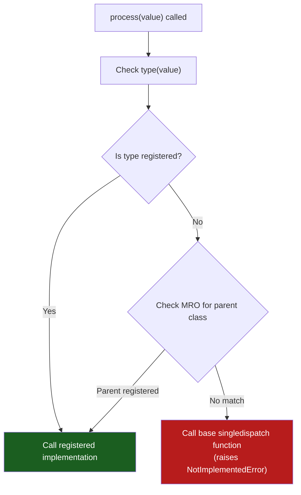

# :material-call-split: singledispatch Idiom

!!! abstract "At a Glance"
    **Goal:** Dispatch to different implementations based on the type of the first argument.
    **C++ Equivalent:** Function overloading, `std::visit` with `std::variant`, tag dispatch.

<div class="grid cards" markdown>

- :material-lightbulb-on: **Core Concept** — Register different implementations per type; dispatch at runtime
- :material-snake: **Python Way** — `@functools.singledispatch` for functions; `@singledispatchmethod` for methods
- :material-alert: **Watch Out** — Only dispatches on the first argument's type; no multi-dispatch
- :material-check-circle: **When to Use** — Type-specific serialisation, rendering, processing pipelines

</div>

## :material-lightbulb-on: Intuition

!!! info "Core Idea"
    C++ supports function overloading — multiple functions with the same name but different
    parameter types, resolved at compile time. Python is dynamically typed and cannot do this
    at the syntactic level. `@singledispatch` provides runtime type dispatch: you register
    one implementation per type, and Python calls the right one based on the argument type.

!!! success "C++ Overloading vs Python singledispatch"
    ```cpp
    // C++ — compile-time overloading
    void process(int x)    { cout << "int: " << x; }
    void process(string s) { cout << "str: " << s; }
    void process(float f)  { cout << "float: " << f; }
    ```
    ```python
    # Python — runtime dispatch via singledispatch
    from functools import singledispatch

    @singledispatch
    def process(arg):
        raise NotImplementedError(f"No handler for {type(arg)}")

    @process.register(int)
    def _(arg: int): print(f"int: {arg}")

    @process.register(str)
    def _(arg: str): print(f"str: {arg}")

    @process.register(float)
    def _(arg: float): print(f"float: {arg}")
    ```

## :material-chart-timeline: Dispatch Resolution



## :material-book-open-variant: `@functools.singledispatch`

```python
from functools import singledispatch
from typing import Any
import json

# Base implementation (called if no registered type matches)
@singledispatch
def serialize(obj: Any) -> str:
    raise NotImplementedError(
        f"No serializer registered for type: {type(obj).__name__}"
    )

@serialize.register(int)
@serialize.register(float)
def _(obj: int | float) -> str:
    return str(obj)

@serialize.register(str)
def _(obj: str) -> str:
    return json.dumps(obj)   # adds quotes and escaping

@serialize.register(list)
def _(obj: list) -> str:
    return "[" + ", ".join(serialize(item) for item in obj) + "]"

@serialize.register(dict)
def _(obj: dict) -> str:
    pairs = ", ".join(
        f"{serialize(k)}: {serialize(v)}" for k, v in obj.items()
    )
    return "{" + pairs + "}"

@serialize.register(bool)
def _(obj: bool) -> str:
    return "true" if obj else "false"   # register bool BEFORE int (subclass)

# Test dispatch
print(serialize(42))               # 42
print(serialize(3.14))             # 3.14
print(serialize("hello"))          # "hello"
print(serialize([1, "two", 3.0]))  # [1, "two", 3.0]
print(serialize(True))             # true
```

!!! warning "Register `bool` before `int`"
    `bool` is a subclass of `int`. If you register `int` first and then `bool`, the `bool`
    registration takes effect for `bool` arguments. If you only register `int`, `True` and
    `False` will be dispatched to the `int` handler because `bool` inherits from `int`.

## :material-code-tags: `@singledispatchmethod` for Classes

```python
from functools import singledispatchmethod

class Renderer:
    """Renders different shapes using singledispatchmethod."""

    @singledispatchmethod
    def render(self, shape) -> str:
        raise NotImplementedError(f"Cannot render {type(shape).__name__}")

    @render.register(Circle)
    def _(self, shape: Circle) -> str:
        return f"<circle cx='0' cy='0' r='{shape.r}'/>"

    @render.register(Rectangle)
    def _(self, shape: Rectangle) -> str:
        return f"<rect width='{shape.width}' height='{shape.height}'/>"

    @render.register(list)
    def _(self, shapes: list) -> str:
        return "\n".join(self.render(s) for s in shapes)

renderer = Renderer()
print(renderer.render(Circle(5)))
print(renderer.render(Rectangle(10, 20)))
```

## :material-compare: `singledispatch` vs `isinstance` Chain

```python
# WITHOUT singledispatch — explicit isinstance chain
def process_old(obj):
    if isinstance(obj, int):
        return f"int: {obj}"
    elif isinstance(obj, str):
        return f"str: {obj}"
    elif isinstance(obj, list):
        return f"list: {obj}"
    else:
        raise NotImplementedError

# WITH singledispatch — extensible, no modification needed to add types
@singledispatch
def process_new(obj):
    raise NotImplementedError

@process_new.register(int)
def _(obj): return f"int: {obj}"

@process_new.register(str)
def _(obj): return f"str: {obj}"

# Add new type handler anywhere — no modification of existing code (Open/Closed)
@process_new.register(float)
def _(obj): return f"float: {obj}"
```

!!! success "Open/Closed Principle"
    `singledispatch` enables the **Open/Closed Principle**: you can add new type handlers
    without modifying the existing dispatch function. This is impossible with the
    `isinstance` chain approach (you must modify the if/elif chain).

## :material-table: `singledispatch` vs Alternatives

| Approach | When to use | Pros | Cons |
|---|---|---|---|
| `@singledispatch` | Type-based dispatch, extensible | Clean, OCP, MRO-aware | Single argument only |
| `isinstance` chain | Simple, few types | Explicit, no setup | Not extensible, grows linearly |
| Method overriding | IS-A hierarchy dispatch | OOP, polymorphic | Requires inheritance |
| `match` statement | Python 3.10+, structural patterns | Powerful pattern matching | Not extensible at runtime |
| `functools.singledispatch` + `Union` | Multiple types → same handler | `@handler.register(A)` + `@handler.register(B)` | Still only first arg |

## :material-alert: Common Pitfalls

!!! warning "Only dispatches on the first positional argument"
    ```python
    @singledispatch
    def f(a, b):
        pass

    @f.register(int)
    def _(a: int, b):
        pass

    f(1, "hello")    # dispatches on type(1) = int — OK
    f("hello", 1)    # dispatches on type("hello") = str — base function called!
    # singledispatch only looks at the FIRST argument
    ```

!!! danger "ABC subclass dispatch may surprise you"
    ```python
    from collections.abc import Sequence

    @singledispatch
    def length(obj): return len(obj)

    @length.register(list)
    def _(obj: list): return f"list with {len(obj)} items"

    print(length([1, 2, 3]))   # "list with 3 items"
    print(length((1, 2, 3)))   # calls base (len) — tuple not registered, but IS Sequence
    # MRO is: tuple -> Sequence -> ... base function is called for tuple
    ```

## :material-help-circle: Flashcards

???+ question "How does `singledispatch` handle subclasses that are not registered?"
    `singledispatch` traverses the MRO (Method Resolution Order) of the argument type.
    If the exact type is not registered, it checks parent classes in MRO order.
    `isinstance(obj, registered_type)` is effectively what it checks. Register the most
    specific type first; the base implementation handles the fallback.

???+ question "What is the difference between `@singledispatch` and `@singledispatchmethod`?"
    `@singledispatch` is for module-level functions. `@singledispatchmethod` (Python 3.8+)
    is for methods in a class — it accounts for the `self` parameter and dispatches on the
    second argument (the first non-self argument). Use `singledispatchmethod` inside classes.

???+ question "Can `singledispatch` handle multiple types for one implementation?"
    Yes — stack multiple `@func.register(Type)` decorators on the same implementation:
    ```python
    @process.register(int)
    @process.register(float)
    def _(obj: int | float) -> str:
        return str(obj)
    ```
    Both `int` and `float` arguments dispatch to the same function.

???+ question "How does `singledispatch` compare to C++ `std::visit` with `std::variant`?"
    Both are type-based dispatch mechanisms. `std::visit` is compile-time (all variants must
    be known at compile time). `singledispatch` is runtime — new types can be registered
    dynamically. C++ `std::variant` is like a closed sum type; Python `singledispatch` is open.
    Python 3.10+ `match` statement is closer to `std::visit` semantically.

## :material-clipboard-check: Self Test

=== "Question 1"
    Implement a `flatten` function using `singledispatch` that flattens nested lists but leaves other types as single-item lists.

=== "Answer 1"
    ```python
    from functools import singledispatch

    @singledispatch
    def flatten(obj) -> list:
        """Base: wrap any non-list object in a list."""
        return [obj]

    @flatten.register(list)
    def _(obj: list) -> list:
        result = []
        for item in obj:
            result.extend(flatten(item))
        return result

    @flatten.register(tuple)
    def _(obj: tuple) -> list:
        return flatten(list(obj))

    print(flatten([1, [2, [3, 4]], 5]))    # [1, 2, 3, 4, 5]
    print(flatten((1, (2, 3), [4, 5])))    # [1, 2, 3, 4, 5]
    print(flatten("hello"))                # ["hello"] — string, not iterated
    ```

=== "Question 2"
    How would you use `singledispatch` to implement a visitor pattern without subclassing?

=== "Answer 2"
    ```python
    from functools import singledispatch
    from dataclasses import dataclass

    @dataclass
    class NumberNode:
        value: float

    @dataclass
    class AddNode:
        left: object
        right: object

    @dataclass
    class MulNode:
        left: object
        right: object

    @singledispatch
    def evaluate(node) -> float:
        raise NotImplementedError(f"No evaluator for {type(node)}")

    @evaluate.register(NumberNode)
    def _(node): return node.value

    @evaluate.register(AddNode)
    def _(node): return evaluate(node.left) + evaluate(node.right)

    @evaluate.register(MulNode)
    def _(node): return evaluate(node.left) * evaluate(node.right)

    # (3 + 4) * 2
    tree = MulNode(AddNode(NumberNode(3), NumberNode(4)), NumberNode(2))
    print(evaluate(tree))   # 14.0
    ```

## :material-check-circle: Summary

!!! success "Key Takeaways"
    - `@singledispatch` dispatches on the type of the first argument at runtime.
    - Register implementations with `@func.register(Type)` — stack for multiple types.
    - `@singledispatchmethod` (Python 3.8+) works inside classes (dispatches on second arg).
    - MRO traversal means subclasses of registered types will match the parent registration.
    - Register `bool` before `int` since `bool` is a subclass of `int`.
    - `singledispatch` enables the Open/Closed Principle — add handlers without modifying existing code.
    - Prefer `singledispatch` over long `isinstance` chains for extensible type dispatch.
