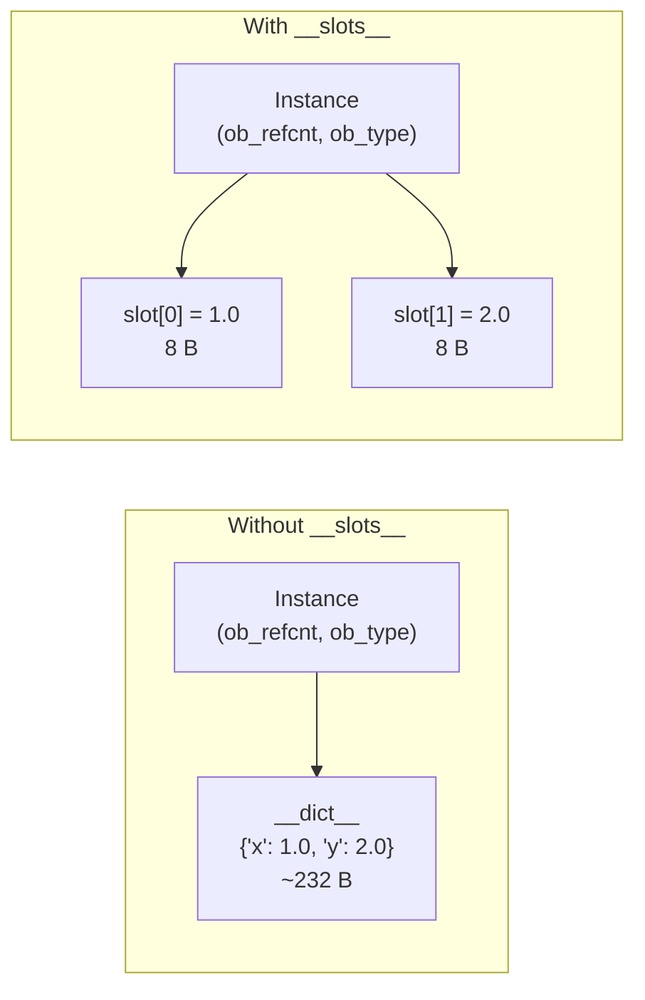

# :material-table-row: `__slots__` Idiom

!!! abstract "At a Glance"
    **Intent / Purpose:** Eliminate the per-instance `__dict__` to reduce memory consumption and speed up attribute access for classes with a fixed, known set of attributes.
    **C++ Equivalent:** A plain `struct` with declared fields — no dynamic member addition, fixed layout
    **Category:** Python Idiom / Memory Optimisation

<div class="grid cards" markdown>
- :material-lightbulb-on: **Core Concept** — `__slots__` replaces the per-instance `dict` with a compact C-level array of descriptors
- :material-snake: **Python Way** — `__slots__ = ('x', 'y')` at class body level; inheritance requires re-declaring or adding new slots
- :material-alert: **Watch Out** — A class with `__slots__` but whose parent does not declare them still has `__dict__` from the parent
- :material-check-circle: **When to Use** — Data-heavy classes with millions of instances (e.g., point clouds, DOM nodes, data records)
</div>

---

## :material-lightbulb-on: Intuition

!!! info "Core Idea"
    Every ordinary Python instance carries a `__dict__` — a full Python dictionary that maps attribute
    names to values. A dictionary has significant overhead: hash table, load factor padding, key strings
    stored as Python objects. For a class with two float attributes, the `__dict__` alone can cost
    200–300 bytes per instance.

    `__slots__` tells CPython: "these are the *only* attributes this class will ever have."
    CPython then allocates a fixed-size C array of *slot descriptors* instead of a dictionary.
    Each attribute access becomes an array index lookup — O(1) with a tiny constant, no hash computation.

    **Trade-off summary:**

    | Feature | `__dict__` (default) | `__slots__` |
    |---------|---------------------|-------------|
    | Memory per instance | 200–400 B overhead | ~50 B per slot |
    | Attribute access speed | dict lookup | array index |
    | Dynamic attribute addition | Yes | No |
    | `pickle` support | Yes | Requires `__getstate__`/`__setstate__` |
    | `weakref` support | Yes (auto) | Only if `'__weakref__'` in slots |

!!! success "Python vs C++"
    In C++, a `struct Point { double x; double y; };` stores exactly two doubles with no overhead — the
    layout is determined at compile time. Python's `__slots__` achieves the same *semantic* guarantee at
    the cost of being a runtime mechanism rather than a compile-time one. The memory saving is real and
    measurable, but Python instances still carry a type pointer and reference count, so the floor is higher
    than a bare C struct.

---

## :material-sitemap: Memory Layout Comparison



---

## :material-book-open-variant: Implementation

### Basic `__slots__` Declaration

```python
class PointDict:
    """Regular class — has __dict__ per instance."""
    def __init__(self, x: float, y: float) -> None:
        self.x = x
        self.y = y


class PointSlots:
    """Slotted class — no __dict__, fixed attributes only."""
    __slots__ = ('x', 'y')

    def __init__(self, x: float, y: float) -> None:
        self.x = x
        self.y = y

    def distance_from_origin(self) -> float:
        return (self.x ** 2 + self.y ** 2) ** 0.5

    def __repr__(self) -> str:
        return f"Point({self.x}, {self.y})"


p_dict  = PointDict(1.0, 2.0)
p_slots = PointSlots(1.0, 2.0)

print(hasattr(p_dict,  "__dict__"))   # True
print(hasattr(p_slots, "__dict__"))   # False

# Dynamic attribute addition — allowed for dict, forbidden for slots
p_dict.z = 3.0    # works fine
try:
    p_slots.z = 3.0
except AttributeError as e:
    print(e)      # 'PointSlots' object has no attribute 'z'
```

### Memory Benchmark with `sys.getsizeof` and `tracemalloc`

```python
import sys
import tracemalloc


def measure_memory(cls, count: int = 100_000) -> tuple[int, int]:
    """Return (peak_bytes, size_of_one_instance)."""
    tracemalloc.start()
    instances = [cls(i * 0.1, i * 0.2) for i in range(count)]
    _, peak = tracemalloc.get_traced_memory()
    tracemalloc.stop()
    size = sys.getsizeof(instances[0])
    return peak, size


peak_dict,  sz_dict  = measure_memory(PointDict)
peak_slots, sz_slots = measure_memory(PointSlots)

print(f"PointDict  — getsizeof: {sz_dict:>4} B | peak for 100k: {peak_dict / 1e6:>6.1f} MB")
print(f"PointSlots — getsizeof: {sz_slots:>4} B | peak for 100k: {peak_slots / 1e6:>6.1f} MB")
print(f"Memory reduction: {(1 - peak_slots / peak_dict) * 100:.1f}%")
# Typical output:
# PointDict  — getsizeof:   48 B | peak for 100k:   27.5 MB
# PointSlots — getsizeof:   56 B | peak for 100k:    9.2 MB
# Memory reduction: 66.5%
```

### Attribute Access Speed Benchmark

```python
import timeit

setup = """
class D:
    def __init__(self): self.x = 1.0
class S:
    __slots__ = ('x',)
    def __init__(self): self.x = 1.0
d = D(); s = S()
"""

t_dict  = timeit.timeit("d.x", setup=setup, number=10_000_000)
t_slots = timeit.timeit("s.x", setup=setup, number=10_000_000)

print(f"dict  access: {t_dict:.3f}s")
print(f"slots access: {t_slots:.3f}s")
print(f"Speedup: {t_dict / t_slots:.2f}x")
# Typical: ~1.2–1.5x faster with slots
```

### Slots with Inheritance

```python
class Base:
    __slots__ = ('id',)

    def __init__(self, id: int) -> None:
        self.id = id


class Extended(Base):
    # Must declare ADDITIONAL slots only — 'id' is already in Base
    __slots__ = ('name', 'value')

    def __init__(self, id: int, name: str, value: float) -> None:
        super().__init__(id)
        self.name  = name
        self.value = value


e = Extended(1, "alpha", 3.14)
print(e.id, e.name, e.value)   # 1 alpha 3.14
print(hasattr(e, "__dict__"))   # False — both Base and Extended use slots


# Pitfall: if Base does NOT define __slots__, subclass still gets __dict__
class NaiveBase:
    pass  # no __slots__ → has __dict__

class SlottedChild(NaiveBase):
    __slots__ = ('x', 'y')

sc = SlottedChild()
sc.z = "surprise"              # allowed! inherits __dict__ from NaiveBase
print(hasattr(sc, "__dict__")) # True
```

### Slots with `__weakref__` and `__dict__`

```python
import weakref


class WeakRefable:
    """Include __weakref__ in slots to allow weak references."""
    __slots__ = ('value', '__weakref__')

    def __init__(self, value):
        self.value = value


obj = WeakRefable(42)
ref = weakref.ref(obj)
print(ref())         # <WeakRefable object>


class HybridSlots:
    """Include __dict__ in slots to allow both fixed fast slots AND dynamic attributes."""
    __slots__ = ('x', 'y', '__dict__')

    def __init__(self, x, y):
        self.x = x
        self.y = y

h = HybridSlots(1, 2)
h.extra = "dynamic"   # allowed — because __dict__ is in slots
print(h.extra)
```

### Slots with `pickle`

```python
import pickle


class SlottedRecord:
    __slots__ = ('name', 'score')

    def __init__(self, name: str, score: float) -> None:
        self.name  = name
        self.score = score

    def __getstate__(self) -> dict:
        return {slot: getattr(self, slot) for slot in self.__slots__}

    def __setstate__(self, state: dict) -> None:
        for slot, value in state.items():
            setattr(self, slot, value)


original = SlottedRecord("Alice", 98.5)
packed   = pickle.dumps(original)
restored = pickle.loads(packed)
print(restored.name, restored.score)   # Alice 98.5
```

---

## :material-alert: Common Pitfalls

!!! warning "Partial Slots — The Parent Without `__slots__`"
    If any class in the MRO does not define `__slots__`, instances still have `__dict__` inherited from
    that class. Slots in subclasses then save only the space for the slotted attributes themselves,
    not the full dictionary overhead. For full memory savings, *every* class in the hierarchy must
    declare `__slots__`.

!!! warning "Forgetting `__weakref__` in Slots"
    By default, slotted objects cannot be weakly referenced. If you pass them to libraries that use
    weak references (e.g., caches, event systems), you get `TypeError: cannot create weak reference`.
    Add `'__weakref__'` to `__slots__` to opt back in.

!!! danger "Slots Do Not Interact Well with Multiple Inheritance"
    If two base classes both define `__slots__`, Python raises `TypeError` only if the slots *conflict*
    (same name in both). Non-conflicting slots are combined. However, if either base defines `__dict__`
    or has no `__slots__`, the subclass gets `__dict__` anyway. Design slot hierarchies carefully.

!!! danger "`dataclasses` and `__slots__` Before Python 3.10"
    Before Python 3.10, `@dataclass` did not support `__slots__` directly. Use
    `@dataclass(slots=True)` (Python 3.10+) or manually declare `__slots__` and avoid the field
    descriptor conflict. In earlier versions the workaround was to create the dataclass, then recreate
    the class with `__slots__`:

    ```python
    # Python 3.10+
    from dataclasses import dataclass

    @dataclass(slots=True)
    class Point:
        x: float
        y: float

    p = Point(1.0, 2.0)
    print(hasattr(p, "__dict__"))  # False
    ```

---

## :material-help-circle: Flashcards

???+ question "What does `__slots__` replace, and what is the memory benefit?"
    `__slots__` replaces the per-instance `__dict__` with a compact C-level array of slot descriptors.
    A Python `dict` has ~200–300 bytes of overhead (hash table, load factor, key objects) regardless
    of content. Slots cost roughly 8 bytes per slot (a pointer) plus the descriptor object on the class.
    For many small instances, this typically reduces per-instance memory by 50–70%.

???+ question "Why does adding `__slots__` to a subclass but not to the parent still leave `__dict__` on instances?"
    Slot declarations are *per-class*, not inherited. If the parent class has `__dict__` (because it
    does not declare `__slots__`), every instance carries that `__dict__` regardless of what the subclass
    declares. The subclass's `__slots__` only prevents *additional* `__dict__` entries for slotted names;
    the parent's `__dict__` remains. Full savings require `__slots__` on every class in the MRO.

???+ question "What two special names can be included in `__slots__` to restore missing features?"
    - `'__weakref__'` — restores the ability to create weak references to instances.
    - `'__dict__'` — restores a per-instance dictionary, enabling dynamic attribute addition while
      still getting fast slot access for declared attributes (a "hybrid" approach).

???+ question "How does `@dataclass(slots=True)` work under the hood in Python 3.10+?"
    Python rebuilds the class after the dataclass decorator processes it: it collects all field names,
    creates a new class with `__slots__` set to those field names, and copies all methods, classmethods,
    and descriptors from the original class to the new one. The original class is discarded. This
    two-step process is necessary because `__slots__` must be set at class *creation* time, before
    `__init__` and other methods are defined.

---

## :material-clipboard-check: Self Test

=== "Question 1"
    You are building a system that creates 5 million `Particle` objects, each with `x: float`, `y: float`,
    `z: float`, `mass: float`, and `alive: bool`. Estimate the memory savings from adding `__slots__`,
    and write the class definition with proper support for `pickle` and weak references.

=== "Answer 1"
    **Memory estimate:**
    Without slots: ~48 B (instance) + ~232 B (`__dict__`) = ~280 B × 5M = ~1.4 GB
    With slots: ~48 B (instance) + 5 × 8 B (slots) = ~88 B × 5M = ~440 MB
    Saving: ~960 MB (~68% reduction)

    ```python
    import pickle
    import weakref

    class Particle:
        __slots__ = ('x', 'y', 'z', 'mass', 'alive', '__weakref__')

        def __init__(
            self, x: float, y: float, z: float,
            mass: float, alive: bool = True
        ) -> None:
            self.x = x; self.y = y; self.z = z
            self.mass = mass; self.alive = alive

        def __getstate__(self) -> dict:
            return {s: getattr(self, s) for s in self.__slots__
                    if s != '__weakref__'}

        def __setstate__(self, state: dict) -> None:
            for k, v in state.items():
                setattr(self, k, v)

        def __repr__(self) -> str:
            return f"Particle({self.x},{self.y},{self.z})"

    p = Particle(1.0, 2.0, 3.0, 9.1e-31)
    assert pickle.loads(pickle.dumps(p)).x == 1.0
    ref = weakref.ref(p)
    print(ref())
    ```

=== "Question 2"
    Explain why the following class definition does NOT eliminate `__dict__`, and fix it.

    ```python
    class Base:
        pass

    class Child(Base):
        __slots__ = ('name', 'value')
    ```

=== "Answer 2"
    `Base` does not declare `__slots__`, so every `Base` instance (and therefore every `Child` instance)
    inherits a `__dict__` from `Base`. The `Child.__slots__` prevents the creation of `name` and `value`
    entries in `__dict__` (they are stored as slots), but the `__dict__` itself still exists, consuming
    the full dictionary overhead.

    **Fix:** declare `__slots__` on `Base` too:

    ```python
    class Base:
        __slots__ = ()   # empty slots — no own attributes, but no __dict__ either

    class Child(Base):
        __slots__ = ('name', 'value')

        def __init__(self, name: str, value: float) -> None:
            self.name  = name
            self.value = value

    c = Child("alpha", 3.14)
    print(hasattr(c, "__dict__"))   # False — correctly eliminated
    ```

---

## :material-check-circle: Summary

!!! success "Key Takeaways"
    - `__slots__` replaces per-instance `__dict__` with a compact C array, reducing memory 50–70% for small, data-heavy instances.
    - Attribute access is 1.2–1.5x faster because it is an array index, not a dict lookup.
    - **Every class in the MRO** must declare `__slots__` for full savings; any parent without `__slots__` reintroduces `__dict__`.
    - Add `'__weakref__'` to `__slots__` to support weak references; add `'__dict__'` for a hybrid (fast slots + dynamic attributes).
    - Slotted classes need `__getstate__`/`__setstate__` for `pickle` compatibility.
    - Python 3.10+ `@dataclass(slots=True)` handles all of this automatically.
    - Use when creating **millions** of instances with a **fixed, known attribute set**; overkill for a handful of objects.
