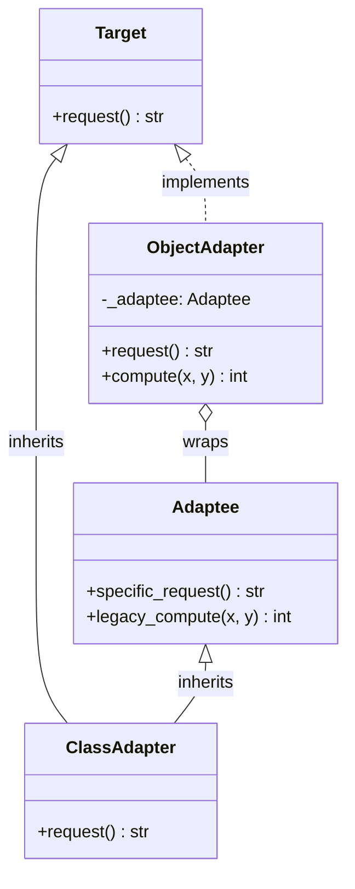

# :material-power-plug: Adapter Pattern

!!! abstract "At a Glance"
    **Intent:** Convert the interface of a class into another interface that clients expect. Lets classes work together that otherwise couldn't due to incompatible interfaces.
    **C++ Equivalent:** Wrapper class with delegation or multiple inheritance
    **Category:** Structural

<div class="grid cards" markdown>

- :material-lightbulb-on: **Core Concept** — Wrap an incompatible object to make it look like the expected interface
- :material-snake: **Python Way** — Composition adapter (preferred) or multiple inheritance class adapter
- :material-alert: **Watch Out** — Adapters can hide bugs — the adaptee may behave differently than expected
- :material-check-circle: **When to Use** — Integrating legacy code, third-party libraries, or mismatched APIs

</div>

## :material-lightbulb-on: Intuition

!!! info "Core Idea"
    An Adapter is a translator. You have an old power plug (Adaptee) that doesn't fit the new socket (Target interface). The adapter is the physical converter that sits between them — the plug doesn't change, the socket doesn't change, only the adapter bridges the gap.

!!! success "Python vs C++"
    | Aspect | C++ | Python |
    |---|---|---|
    | Object adapter | Composition + delegation | Same — composition preferred |
    | Class adapter | Multiple inheritance | Multiple inheritance (less common) |
    | Interface definition | Abstract class | `Protocol` or `ABC` |
    | Transparency | Requires careful API match | Duck typing makes it natural |

## :material-vector-polyline: Structure



## :material-book-open-variant: Implementation

### Object Adapter (Preferred)

```python
from __future__ import annotations
from abc import ABC, abstractmethod


class Target(ABC):
    """The interface clients expect."""

    @abstractmethod
    def request(self) -> str:
        ...

    @abstractmethod
    def compute(self, x: int, y: int) -> int:
        ...


class Adaptee:
    """Legacy class with incompatible interface."""

    def specific_request(self) -> str:
        return "!esaeler eht fo esnopser eht si sihT"  # reversed

    def legacy_compute(self, x: int, y: int) -> int:
        return x * y + 1  # off-by-one legacy bug fixed in adapter


class ObjectAdapter(Target):
    """Adapts Adaptee to Target via composition."""

    def __init__(self, adaptee: Adaptee) -> None:
        self._adaptee = adaptee

    def request(self) -> str:
        return self._adaptee.specific_request()[::-1]  # reverse back

    def compute(self, x: int, y: int) -> int:
        return self._adaptee.legacy_compute(x, y) - 1  # fix off-by-one


class ClassAdapter(Target, Adaptee):
    """Adapts via multiple inheritance."""

    def request(self) -> str:
        return self.specific_request()[::-1]

    def compute(self, x: int, y: int) -> int:
        return self.legacy_compute(x, y) - 1
```

### Real-World Example: JSON → Dict Adapter

```python
import json
from typing import Any


class JSONDataSource:
    """Legacy API returning JSON strings."""

    def get_data_as_json(self) -> str:
        return '{"name": "Alice", "age": 30}'


class DictDataSource(ABC):
    """New interface — expects dict."""

    @abstractmethod
    def get_data(self) -> dict[str, Any]:
        ...


class JSONToDictAdapter(DictDataSource):
    """Adapts JSONDataSource to DictDataSource."""

    def __init__(self, source: JSONDataSource) -> None:
        self._source = source

    def get_data(self) -> dict[str, Any]:
        return json.loads(self._source.get_data_as_json())


# Client only knows DictDataSource
def display(source: DictDataSource) -> None:
    data = source.get_data()
    print(f"Name: {data['name']}, Age: {data['age']}")


if __name__ == "__main__":
    legacy = JSONDataSource()
    adapted = JSONToDictAdapter(legacy)
    display(adapted)  # Name: Alice, Age: 30
```

### Two-Way Adapter

```python
class TwoWayAdapter(Target):
    """Can adapt to both directions."""

    def __init__(self, adaptee: Adaptee) -> None:
        self._adaptee = adaptee

    def request(self) -> str:
        return self._adaptee.specific_request()[::-1]

    def compute(self, x: int, y: int) -> int:
        return self._adaptee.legacy_compute(x, y) - 1

    def get_adaptee(self) -> Adaptee:
        """Access the wrapped adaptee if needed."""
        return self._adaptee
```

## :material-alert: Common Pitfalls

!!! warning "Adapter Hiding Bugs"
    If the Adaptee has subtle behavioural differences (e.g., different error types, different return ranges), the Adapter may paper over bugs rather than fix them. Always test the adapted interface thoroughly.

!!! danger "Too Many Adapters = Design Smell"
    If you need many adapters in one codebase, the real problem may be an inconsistent API design. Consider refactoring the interfaces rather than adapting everything.

## :material-help-circle: Flashcards

???+ question "What is the difference between Object Adapter and Class Adapter?"
    - **Object Adapter**: uses composition — wraps the adaptee instance. More flexible; adaptee can be swapped at runtime.
    - **Class Adapter**: uses multiple inheritance — inherits from both Target and Adaptee. Tighter coupling; not always possible if Target is already a class.

???+ question "When should you use the Adapter pattern?"
    Use it when:

    - Integrating a third-party library with a different interface
    - Reusing legacy code that can't be modified
    - Making two independently developed systems work together
    - Writing tests with mock objects that need to conform to an interface

???+ question "How does duck typing affect the need for Adapter in Python?"
    Python's duck typing reduces the need for formal Adapter classes. If the adaptee already has methods with the right names and signatures, no adapter is needed. Adapters become necessary only when method names or signatures genuinely differ.

???+ question "What is the relationship between Adapter and Facade?"
    Both wrap existing code. Key difference:

    - **Adapter** changes the interface to match an expected one (1:1 wrapping)
    - **Facade** simplifies a complex subsystem into a single easy interface (N:1 simplification)

## :material-clipboard-check: Self Test

=== "Question 1"
    You have a `LegacyLogger` with `log_message(msg: str, level: int)` but your codebase uses a `Logger` protocol requiring `debug(msg)`, `info(msg)`, `error(msg)`. Write an Adapter.

=== "Answer 1"
    ```python
    class LegacyLogger:
        def log_message(self, msg: str, level: int) -> None:
            print(f"[{level}] {msg}")

    class Logger(Protocol):
        def debug(self, msg: str) -> None: ...
        def info(self, msg: str) -> None: ...
        def error(self, msg: str) -> None: ...

    class LegacyLoggerAdapter:
        def __init__(self, legacy: LegacyLogger) -> None:
            self._legacy = legacy

        def debug(self, msg: str) -> None:
            self._legacy.log_message(msg, 0)

        def info(self, msg: str) -> None:
            self._legacy.log_message(msg, 1)

        def error(self, msg: str) -> None:
            self._legacy.log_message(msg, 2)
    ```

=== "Question 2"
    What is the key advantage of the Object Adapter over the Class Adapter in Python?

=== "Answer 2"
    The **Object Adapter** (composition) is more flexible:

    - The adaptee can be replaced at runtime
    - Works even if the Target is a concrete class (Python allows multiple inheritance but it gets complicated)
    - Easier to test — you can pass a mock adaptee
    - Follows the "favour composition over inheritance" principle

    The **Class Adapter** (inheritance) only works when both Target and Adaptee can be inherited from, and creates tighter coupling.

## :material-check-circle: Summary

!!! success "Key Takeaways"
    - Adapter converts an incompatible interface into the expected one — without changing either side
    - **Object Adapter** (composition) is preferred in Python — more flexible, easier to test
    - **Class Adapter** (multiple inheritance) is less common but occasionally useful
    - Duck typing means Python Adapters are often lighter than their C++ equivalents
    - Watch for adapters hiding behavioural differences, not just interface differences
