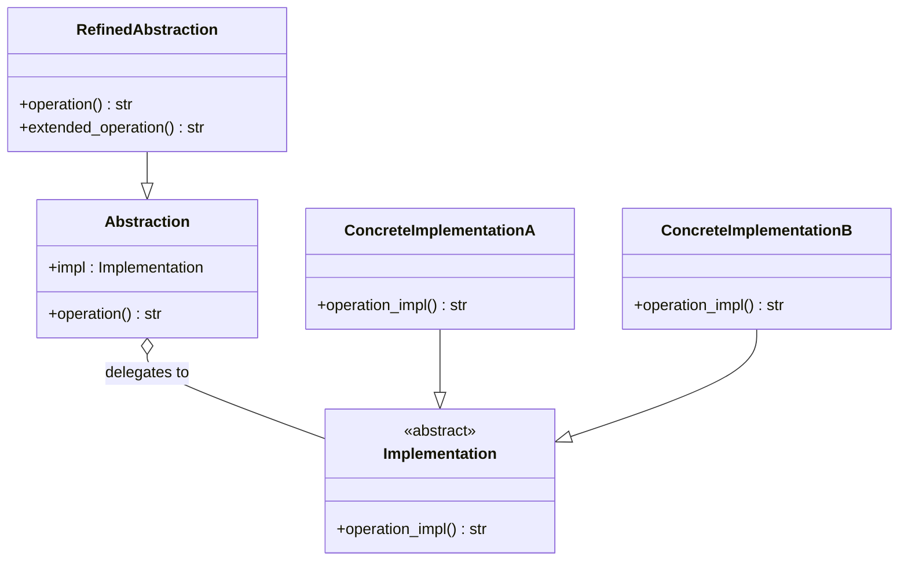

# :material-bridge: Bridge Pattern

!!! abstract "At a Glance"
    **Intent / Purpose:** Decouple an abstraction from its implementation so both can vary independently without affecting each other.
    **C++ Equivalent:** Pointer-to-implementation (Pimpl), virtual dispatch with separate hierarchy
    **Category:** Structural

<div class="grid cards" markdown>
- :material-lightbulb-on: **Core Concept** — Separate *what* a thing does (abstraction) from *how* it does it (implementation)
- :material-snake: **Python Way** — Composition via `Protocol` or ABC; `impl` attribute injected at construction
- :material-alert: **Watch Out** — Don't bridge when simple composition already suffices; adds indirection cost
- :material-check-circle: **When to Use** — You want abstraction and implementation to evolve on independent axes
</div>

---

## :material-lightbulb-on: Intuition

!!! info "Core Idea"
    Imagine a universal TV remote (abstraction) that can control any brand of television (implementation).
    The remote does not need to know *how* Sony or Samsung switch channels internally — it delegates through
    a common interface. Adding a new TV brand never changes the remote's logic, and redesigning the remote
    never changes the TV firmware. The **bridge** is the interface contract between them.

    Key insight: prefer **composition** over inheritance when you would otherwise need an exponential class
    explosion. Without Bridge, `m` abstractions × `n` implementations → `m × n` classes. With Bridge → `m + n`.

!!! success "Python vs C++"
    In C++ you typically implement Bridge as a pair of virtual base classes and inject a raw/smart pointer.
    Python's duck typing lets you skip explicit base classes entirely — a plain object with the right methods
    works. The `Protocol` class (PEP 544) expresses the structural contract without forcing inheritance,
    making the bridge feel like idiomatic composition rather than a heavyweight pattern.

---

## :material-sitemap: Structure



---

## :material-book-open-variant: Implementation

### Classic Bridge — Shape + Renderer

The abstraction axis is the **shape** (Circle, Square); the implementation axis is the **renderer** (vector vs raster).
Adding a new shape or a new renderer never touches the opposite hierarchy.

```python
from __future__ import annotations
from abc import ABC, abstractmethod
import math


# ── Implementation hierarchy ──────────────────────────────────────────────────
class Renderer(ABC):
    """How a shape is rendered (the implementation axis)."""

    @abstractmethod
    def render_circle(self, x: float, y: float, radius: float) -> str: ...

    @abstractmethod
    def render_rectangle(self, x: float, y: float, w: float, h: float) -> str: ...


class VectorRenderer(Renderer):
    def render_circle(self, x, y, radius):
        return f"<circle cx='{x}' cy='{y}' r='{radius}'/>"

    def render_rectangle(self, x, y, w, h):
        return f"<rect x='{x}' y='{y}' width='{w}' height='{h}'/>"


class RasterRenderer(Renderer):
    def render_circle(self, x, y, radius):
        return f"[RASTER] circle at ({x},{y}) r={radius} px"

    def render_rectangle(self, x, y, w, h):
        return f"[RASTER] rect at ({x},{y}) {w}×{h} px"


# ── Abstraction hierarchy ─────────────────────────────────────────────────────
class Shape(ABC):
    """What the shape is (the abstraction axis)."""

    def __init__(self, renderer: Renderer) -> None:
        self.renderer = renderer          # THE bridge

    @abstractmethod
    def draw(self) -> str: ...

    @abstractmethod
    def resize(self, factor: float) -> None: ...


class Circle(Shape):
    def __init__(self, x: float, y: float, radius: float, renderer: Renderer) -> None:
        super().__init__(renderer)
        self.x, self.y, self.radius = x, y, radius

    def draw(self) -> str:
        return self.renderer.render_circle(self.x, self.y, self.radius)

    def resize(self, factor: float) -> None:
        self.radius *= factor


class Rectangle(Shape):
    def __init__(self, x, y, w, h, renderer: Renderer) -> None:
        super().__init__(renderer)
        self.x, self.y, self.w, self.h = x, y, w, h

    def draw(self) -> str:
        return self.renderer.render_rectangle(self.x, self.y, self.w, self.h)

    def resize(self, factor: float) -> None:
        self.w *= factor
        self.h *= factor


# ── Usage ─────────────────────────────────────────────────────────────────────
if __name__ == "__main__":
    svg = VectorRenderer()
    png = RasterRenderer()

    c = Circle(5, 5, 10, svg)
    print(c.draw())           # <circle cx='5' cy='5' r='10'/>
    c.renderer = png          # swap implementation at runtime!
    print(c.draw())           # [RASTER] circle at (5,5) r=10 px

    r = Rectangle(0, 0, 100, 50, svg)
    print(r.draw())
```

### Protocol-Based Bridge (Pythonic — no ABC needed)

```python
from typing import Protocol, runtime_checkable


@runtime_checkable
class Device(Protocol):
    """Implementation interface — any object satisfying this works."""
    def turn_on(self) -> None: ...
    def turn_off(self) -> None: ...
    def set_volume(self, level: int) -> None: ...
    def get_status(self) -> dict: ...


class TV:
    def turn_on(self):  print("TV: screen on")
    def turn_off(self): print("TV: screen off")
    def set_volume(self, level: int): print(f"TV: volume → {level}")
    def get_status(self) -> dict: return {"type": "TV", "on": True}


class Radio:
    def turn_on(self):  print("Radio: tuner on")
    def turn_off(self): print("Radio: tuner off")
    def set_volume(self, level: int): print(f"Radio: volume → {level}")
    def get_status(self) -> dict: return {"type": "Radio", "on": True}


# Abstraction — unaware of concrete Device type
class RemoteControl:
    def __init__(self, device: Device) -> None:
        self.device = device

    def toggle_power(self, currently_on: bool) -> None:
        if currently_on:
            self.device.turn_off()
        else:
            self.device.turn_on()

    def volume_up(self, current: int) -> int:
        new = min(current + 10, 100)
        self.device.set_volume(new)
        return new


class AdvancedRemote(RemoteControl):
    """Refined abstraction — adds mute on top of basic remote."""

    def mute(self) -> None:
        self.device.set_volume(0)


# Swap devices freely — the abstraction never changes
remote = AdvancedRemote(TV())
remote.toggle_power(False)   # TV: screen on
remote.mute()                # TV: volume → 0

remote.device = Radio()      # bridge runtime swap
remote.toggle_power(False)   # Radio: tuner on
```

---

## :material-alert: Common Pitfalls

!!! warning "Over-Engineering for Simple Cases"
    If you only have **one** implementation now and no realistic plan to add a second, Bridge adds
    needless indirection. Prefer plain composition until the second dimension truly appears.

!!! warning "Leaky Abstraction via Downcasting"
    Never do `if isinstance(self.impl, ConcreteImplA): ...` inside the abstraction — that defeats the
    entire purpose and tightly couples both sides again.

!!! danger "Forgetting the Implementation Contract"
    When using duck typing (no formal `Protocol`), missing a method in a new implementation raises
    `AttributeError` at runtime, not at import time. Use `@runtime_checkable Protocol` and an `isinstance`
    assertion during construction to catch mismatches early:

    ```python
    assert isinstance(device, Device), f"{device!r} does not satisfy the Device protocol"
    ```

!!! danger "Mutable Shared Implementation"
    If two abstractions share one implementation instance **and** the implementation holds mutable state,
    you'll get spooky action at a distance. Either ensure the implementation is stateless or give each
    abstraction its own instance.

---

## :material-help-circle: Flashcards

???+ question "What problem does Bridge solve that simple inheritance does not?"
    Inheritance fuses abstraction and implementation into one hierarchy, forcing `m × n` subclasses when
    you have `m` abstractions and `n` implementations. Bridge separates them into two independent
    hierarchies and uses **composition** (the `impl` reference) to connect them, requiring only `m + n` classes.

???+ question "How does Python's `Protocol` improve on the classic Bridge pattern?"
    `Protocol` enables **structural subtyping**: any class with the right methods satisfies the interface
    without explicitly inheriting from it. This means third-party or legacy classes can act as implementations
    without modification — you simply wrap them if necessary.

???+ question "When should you swap the implementation at runtime vs at construction?"
    Swap at construction when the binding is logical (e.g., platform-specific renderer chosen once on startup).
    Swap at runtime when a genuine dynamic need exists (e.g., switching from online to offline storage backend
    based on connectivity). Document runtime swaps clearly; they can be hard to trace.

???+ question "What is the difference between Bridge and Strategy?"
    Both use composition to delegate behaviour. The distinction is intent and scope: **Strategy** varies a
    *single algorithm* of a class (how it does one thing), while **Bridge** separates an entire *abstraction
    hierarchy* from an entire *implementation hierarchy* so both can grow independently.

---

## :material-clipboard-check: Self Test

=== "Question 1"
    You are building a notification system. You want to support message types (`Alert`, `Reminder`, `Newsletter`)
    and delivery channels (`Email`, `SMS`, `Push`). How would you apply Bridge, and what classes would you create?

=== "Answer 1"
    **Two independent hierarchies:**

    - **Implementation axis** — `Channel` ABC (or Protocol) with `send(subject, body)`, plus `EmailChannel`,
      `SMSChannel`, `PushChannel`.
    - **Abstraction axis** — `Notification` base with `channel: Channel`, plus `Alert`, `Reminder`, `Newsletter`
      each overriding `deliver()` to format the message and call `self.channel.send(...)`.

    This gives 3 + 3 = 6 classes instead of 3 × 3 = 9. A new `SlackChannel` requires zero changes to
    the notification side; a new `DailySummary` type requires zero changes to the channel side.

=== "Question 2"
    What runtime assertion would you add to `RemoteControl.__init__` to guard against an object that does not
    satisfy the `Device` Protocol, and why is this better than a bare `hasattr` check?

=== "Answer 2"
    ```python
    from typing import get_protocol_members

    def __init__(self, device: Device) -> None:
        if not isinstance(device, Device):   # works because Device is @runtime_checkable
            raise TypeError(
                f"Expected a Device-compatible object, got {type(device).__name__}"
            )
        self.device = device
    ```

    `isinstance` against a `@runtime_checkable Protocol` checks **all** required methods in one call and
    uses Python's official mechanism, whereas manual `hasattr` calls are ad-hoc, easy to forget to update,
    and do not integrate with type checkers like mypy.

---

## :material-check-circle: Summary

!!! success "Key Takeaways"
    - **Bridge = Composition over inheritance** when variation lives on two independent axes.
    - The abstraction holds a reference to the implementation interface — this reference *is* the bridge.
    - Python's duck typing and `Protocol` make Bridge natural; you often get it "for free" by designing
      with composition from the start.
    - Swap implementations at construction or at runtime — both are valid; document the intent.
    - Guard the contract with `@runtime_checkable Protocol` + `isinstance` to catch mismatches early.
    - Classic rule of thumb: if you feel the urge to create a subclass *just* to change the backend,
      reach for Bridge (or plain composition) instead.
