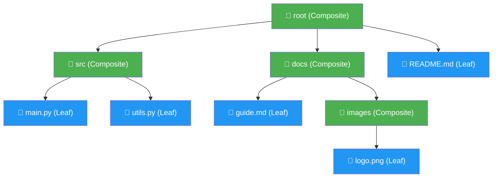

# :material-file-tree: Composite Pattern

!!! abstract "At a Glance"
    **Intent / Purpose:** Compose objects into tree structures to represent part-whole hierarchies; let clients treat individual objects and compositions uniformly.
    **C++ Equivalent:** Polymorphic base class with `virtual void add(Component*)`, recursive `vector<Component*>` children
    **Category:** Structural

<div class="grid cards" markdown>
- :material-lightbulb-on: **Core Concept** — A single interface for both leaves (no children) and composites (have children)
- :material-snake: **Python Way** — `__iter__`, `__len__`, `__contains__` make Composite feel like a native Python container
- :material-alert: **Watch Out** — Clients that need to distinguish leaf from composite break the uniformity guarantee
- :material-check-circle: **When to Use** — Whenever your data is naturally a tree: file systems, UI widgets, org charts, ASTs
</div>

---

## :material-lightbulb-on: Intuition

!!! info "Core Idea"
    Think of a file system. A **file** (leaf) has a name and size — it cannot contain anything.
    A **directory** (composite) also has a name and size, but its size is the sum of its children.
    Yet to *walk*, *search*, or *compute sizes*, you want to call the same `size()` or `display()`
    on both without asking "is this a file or a folder?" first.

    Composite lets you write:
    ```python
    for item in root:          # works whether root is a file or a folder
        print(item.size())
    ```
    and the correct behaviour is dispatched by the type, not by an `if isinstance(...)` chain.

!!! success "Python vs C++"
    C++ implementations use virtual destructors, raw/smart pointer children, and explicit `add()`/`remove()`
    methods on a base class that also must exist (even if meaningless) for leaves. Python avoids this
    awkwardness: leaves simply do not implement the mutation methods, or raise `NotImplementedError`, and
    the container protocol (`__iter__`, `__len__`) makes composites behave like built-in collections — you
    can pass a composite anywhere an iterable is expected.

---

## :material-sitemap: Structure



---

## :material-book-open-variant: Implementation

### Core ABC and File System Example

```python
from __future__ import annotations
from abc import ABC, abstractmethod
from typing import Iterator


# ── Component (uniform interface) ─────────────────────────────────────────────
class FileSystemItem(ABC):
    def __init__(self, name: str) -> None:
        self.name = name

    @abstractmethod
    def size(self) -> int:
        """Return size in bytes."""
        ...

    @abstractmethod
    def display(self, indent: int = 0) -> None:
        """Pretty-print the tree."""
        ...

    # Optional: let leaves participate in iteration gracefully
    def __iter__(self) -> Iterator[FileSystemItem]:
        return iter([])   # leaves yield nothing

    def __repr__(self) -> str:
        return f"{type(self).__name__}({self.name!r})"


# ── Leaf ──────────────────────────────────────────────────────────────────────
class File(FileSystemItem):
    def __init__(self, name: str, size_bytes: int) -> None:
        super().__init__(name)
        self._size = size_bytes

    def size(self) -> int:
        return self._size

    def display(self, indent: int = 0) -> None:
        print(f"{'  ' * indent}📄 {self.name}  ({self._size:,} B)")


# ── Composite ─────────────────────────────────────────────────────────────────
class Directory(FileSystemItem):
    def __init__(self, name: str) -> None:
        super().__init__(name)
        self._children: list[FileSystemItem] = []

    # ── Composite-specific management ────────────────────────────────────────
    def add(self, item: FileSystemItem) -> Directory:
        self._children.append(item)
        return self                     # fluent interface

    def remove(self, item: FileSystemItem) -> None:
        self._children.remove(item)

    # ── Container protocol — makes Directory feel like a list ─────────────────
    def __iter__(self) -> Iterator[FileSystemItem]:
        return iter(self._children)

    def __len__(self) -> int:
        return len(self._children)

    def __contains__(self, item: object) -> bool:
        return item in self._children

    # ── Uniform interface ─────────────────────────────────────────────────────
    def size(self) -> int:
        return sum(child.size() for child in self)   # recursive!

    def display(self, indent: int = 0) -> None:
        print(f"{'  ' * indent}📁 {self.name}/  ({self.size():,} B)")
        for child in self:
            child.display(indent + 1)


# ── Usage ─────────────────────────────────────────────────────────────────────
if __name__ == "__main__":
    root = Directory("project")
    src  = Directory("src")
    docs = Directory("docs")

    src.add(File("main.py",  4_200)).add(File("utils.py", 1_800))
    docs.add(File("guide.md", 8_500)).add(
        Directory("images").add(File("logo.png", 45_000))
    )
    root.add(src).add(docs).add(File("README.md", 2_100))

    root.display()
    # 📁 project/  (61,600 B)
    #   📁 src/  (6,000 B)
    #     📄 main.py  (4,200 B)
    #     📄 utils.py  (1,800 B)
    #   📁 docs/  (53,500 B)
    #     📄 guide.md  (8,500 B)
    #     📁 images/  (45,000 B)
    #       📄 logo.png  (45,000 B)
    #   📄 README.md  (2,100 B)

    print(f"\nTotal project size: {root.size():,} B")
    print(f"src has {len(src)} direct children")
    print(f"Is main.py in src? {File('main.py', 0) in src}")
```

### UI Widget Hierarchy

```python
class Widget(ABC):
    def __init__(self, widget_id: str) -> None:
        self.widget_id = widget_id

    @abstractmethod
    def render(self, depth: int = 0) -> str: ...

    def __iter__(self) -> Iterator[Widget]:
        return iter([])


class Button(Widget):
    def __init__(self, widget_id: str, label: str) -> None:
        super().__init__(widget_id)
        self.label = label

    def render(self, depth: int = 0) -> str:
        pad = "  " * depth
        return f"{pad}<button id='{self.widget_id}'>{self.label}</button>"


class Panel(Widget):
    def __init__(self, widget_id: str) -> None:
        super().__init__(widget_id)
        self._widgets: list[Widget] = []

    def add(self, w: Widget) -> Panel:
        self._widgets.append(w)
        return self

    def __iter__(self) -> Iterator[Widget]:
        return iter(self._widgets)

    def render(self, depth: int = 0) -> str:
        pad  = "  " * depth
        body = "\n".join(w.render(depth + 1) for w in self)
        return f"{pad}<div id='{self.widget_id}'>\n{body}\n{pad}</div>"


toolbar = Panel("toolbar")
toolbar.add(Button("btn-save", "Save")).add(Button("btn-load", "Load"))

main_panel = Panel("main")
main_panel.add(toolbar).add(Button("btn-submit", "Submit"))

print(main_panel.render())
```

### Org Chart — Accumulating Across the Tree

```python
from dataclasses import dataclass, field


@dataclass
class Employee:
    name: str
    role: str
    salary: float
    reports: list[Employee] = field(default_factory=list)

    def add_report(self, e: Employee) -> Employee:
        self.reports.append(e)
        return self

    def total_salary_cost(self) -> float:
        """Own salary + all direct and indirect reports."""
        return self.salary + sum(r.total_salary_cost() for r in self.reports)

    def headcount(self) -> int:
        return 1 + sum(r.headcount() for r in self.reports)

    def __iter__(self):
        yield self
        for r in self.reports:
            yield from r          # depth-first walk of the tree


ceo = Employee("Alice", "CEO", 200_000)
vp1 = Employee("Bob",   "VP Engineering", 150_000)
vp2 = Employee("Carol", "VP Sales",       140_000)

vp1.add_report(Employee("Dave", "Senior Dev",   120_000))
vp1.add_report(Employee("Eve",  "Junior Dev",    80_000))
vp2.add_report(Employee("Frank","Account Exec",  90_000))

ceo.add_report(vp1).add_report(vp2)

print(f"Headcount: {ceo.headcount()}")           # 6
print(f"Total cost: ${ceo.total_salary_cost():,.0f}")  # $780,000

# Uniform iteration — same code for leaf or composite
for emp in ceo:
    print(f"  {emp.role}: {emp.name}")
```

---

## :material-alert: Common Pitfalls

!!! warning "Breaking Uniformity with isinstance Checks"
    The moment client code writes `if isinstance(item, Directory): item.add(...)`, the pattern's main
    benefit is lost. Move management operations (`add`, `remove`) to the composite level and keep the
    *uniform* interface clean. If callers need to build trees, give them a builder or factory.

!!! warning "Infinite Recursion from Circular References"
    Never add a composite to itself (or to one of its descendants). Protect with a guard:

    ```python
    def add(self, item: FileSystemItem) -> Directory:
        if item is self:
            raise ValueError("Cannot add a directory to itself")
        self._children.append(item)
        return self
    ```

!!! danger "Large Trees and Stack Overflow"
    Python's default recursion limit is 1000. A deep tree (e.g., a deeply nested AST or file path with
    1000+ directory levels) will hit `RecursionError`. Use an explicit stack for iteration instead of
    recursive calls:

    ```python
    def walk(root: FileSystemItem):
        stack = [root]
        while stack:
            item = stack.pop()
            yield item
            stack.extend(reversed(list(item)))   # right-to-left for DFS order
    ```

!!! danger "Shared Mutable Children Lists"
    If you shallow-copy a `Composite`, both copies share the same `_children` list — mutations to one
    silently affect the other. Always deep-copy when cloning a composite node.

---

## :material-help-circle: Flashcards

???+ question "What two roles exist in the Composite pattern, and what distinguishes them?"
    **Leaf**: a terminal node with no children. It implements the component interface with concrete,
    self-contained behaviour (e.g., `File.size()` returns its own byte count).
    **Composite**: an internal node that holds a collection of children (leaves or other composites)
    and implements the component interface by delegating to — and usually aggregating — its children.

???+ question "Why does the Python Composite benefit from implementing `__iter__` and `__len__`?"
    It makes Composite instances behave like native Python sequences. You can use `for child in node`,
    `len(node)`, `in` membership tests, and pass composites directly to functions that accept iterables
    (e.g., `list()`, `sum()`, `max()`). This removes the need for explicit getter methods like
    `get_children()` and makes the API feel idiomatic.

???+ question "How do you perform a depth-first walk of a Composite tree using `yield from`?"
    ```python
    def walk(node):
        yield node
        for child in node:
            yield from walk(child)
    ```
    Because `File.__iter__` returns an empty iterator, `yield from walk(file)` simply yields the file
    and stops — no special-casing needed.

???+ question "What is the safety trade-off of placing `add()`/`remove()` on the Component base class vs only on Composite?"
    **On Component (transparency):** clients can call `add()` on any node uniformly, but leaves must
    raise `NotImplementedError`, which is discovered at runtime. **On Composite only (safety):** the
    compiler / type checker rejects `leaf.add(...)` at the call site. Python best practice is the
    safety approach: define management methods only on `Composite` and use typing to enforce this.

---

## :material-clipboard-check: Self Test

=== "Question 1"
    A menu system has `MenuItem` (leaf) and `Menu` (composite). Both need a `render()` method.
    `Menu.render()` should output an HTML `<ul>` containing `<li>` items rendered by each child.
    Sketch the class hierarchy and implement `render()` for both.

=== "Answer 1"
    ```python
    from abc import ABC, abstractmethod

    class MenuComponent(ABC):
        @abstractmethod
        def render(self, depth: int = 0) -> str: ...
        def __iter__(self): return iter([])

    class MenuItem(MenuComponent):
        def __init__(self, label: str, url: str) -> None:
            self.label, self.url = label, url
        def render(self, depth: int = 0) -> str:
            pad = "  " * depth
            return f"{pad}<li><a href='{self.url}'>{self.label}</a></li>"

    class Menu(MenuComponent):
        def __init__(self, title: str) -> None:
            self.title = title
            self._items: list[MenuComponent] = []
        def add(self, item: MenuComponent) -> Menu:
            self._items.append(item); return self
        def __iter__(self): return iter(self._items)
        def render(self, depth: int = 0) -> str:
            pad  = "  " * depth
            body = "\n".join(item.render(depth + 1) for item in self)
            return f"{pad}<ul title='{self.title}'>\n{body}\n{pad}</ul>"

    nav = Menu("Nav")
    nav.add(MenuItem("Home", "/")).add(MenuItem("About", "/about"))
    sub = Menu("Products")
    sub.add(MenuItem("Widget A", "/products/a")).add(MenuItem("Widget B", "/products/b"))
    nav.add(sub)
    print(nav.render())
    ```

=== "Question 2"
    Given a `Directory` composite, write a generator function `find(root, extension)` that yields
    every `File` whose name ends with the given extension, at any depth.

=== "Answer 2"
    ```python
    from typing import Generator

    def find(root: FileSystemItem, extension: str) -> Generator[File, None, None]:
        for item in root:                       # __iter__ on Leaf returns [] — safe
            if isinstance(item, File):
                if item.name.endswith(extension):
                    yield item
            else:
                yield from find(item, extension)  # recurse into sub-directories

    # Usage
    for py_file in find(root, ".py"):
        print(py_file.name, py_file.size())
    ```
    Because `File.__iter__` yields nothing, this generator never tries to iterate a leaf — no guard needed.

---

## :material-check-circle: Summary

!!! success "Key Takeaways"
    - **Composite = uniform tree interface.** Clients call `size()`, `render()`, or `walk()` without
      knowing whether they hold a leaf or a composite node.
    - Implement `__iter__` on both leaf (returning empty iterator) and composite (returning children iterator)
      to enable the full Python container protocol without special-casing.
    - Use `yield from` for elegant recursive depth-first traversal — it automatically bottoms out at leaves.
    - Guard against circular references and deep stacks in production code.
    - Place `add()`/`remove()` only on `Composite`, not on the base class, to catch type errors early.
    - Natural fits: file systems, UI widget trees, org charts, expression trees, HTML/XML DOM, scene graphs.
