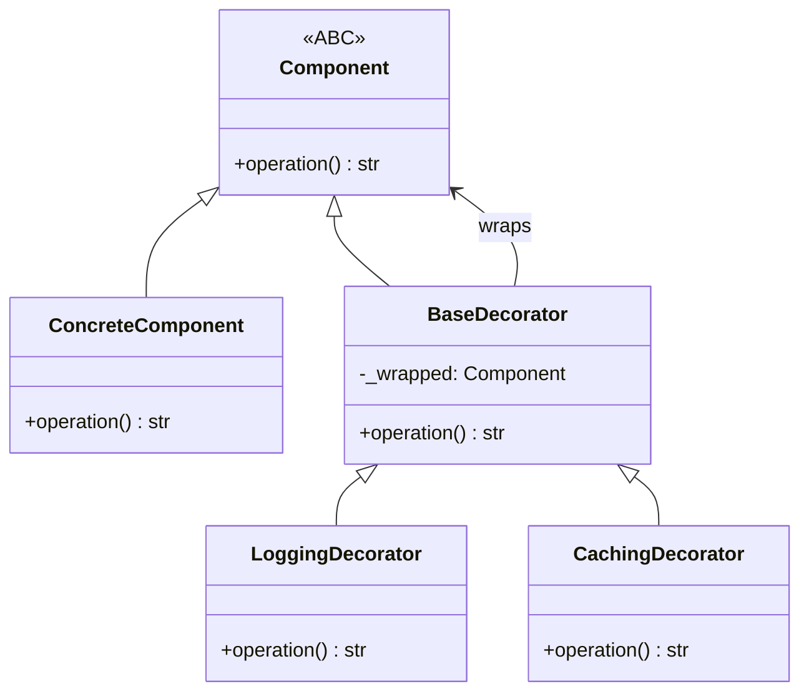

# :material-layers-plus: Decorator Pattern

!!! abstract "At a Glance"
    **Goal:** Attach additional responsibilities to an object dynamically; a flexible alternative to subclassing.
    **C++ Equivalent:** Wrapper class that inherits the same interface and delegates to the wrapped object.

<div class="grid cards" markdown>

- :material-lightbulb-on: **Core Concept** — Wrap an object to add behaviour without changing its class
- :material-snake: **Python Way** — Python `@decorator` syntax wraps callables; GoF Decorator wraps objects
- :material-alert: **Watch Out** — Python `@decorator` and GoF Decorator are different patterns!
- :material-check-circle: **When to Use** — Cross-cutting concerns: logging, caching, auth, retry

</div>

## :material-lightbulb-on: Intuition

!!! info "Core Idea"
    There are **two distinct patterns** called "Decorator" in Python:

    1. **Python `@decorator` syntax** — wraps a callable (function or class) with another callable.
       Used for cross-cutting concerns (logging, timing, caching).
    2. **GoF Structural Decorator** — wraps an object with another object of the same interface.
       Used to add behaviour to individual object instances dynamically.

    Both are useful. Both use composition over inheritance. Understanding the difference prevents confusion.

!!! success "Python @decorator vs GoF Decorator"
    | | Python `@decorator` | GoF Structural Decorator |
    |---|---|---|
    | Wraps | Functions / callables | Objects |
    | Interface | Any callable | Same as wrapped object |
    | Composition | Function wraps function | Object wraps object |
    | Typical use | Cross-cutting concerns | Feature layering |
    | Python syntax | `@decorator` | Manual instantiation |

## :material-chart-timeline: Decorator Structure



## :material-book-open-variant: GoF Structural Decorator

```python
from abc import ABC, abstractmethod
from typing import Any

class TextTransformer(ABC):
    @abstractmethod
    def transform(self, text: str) -> str: ...

class PlainText(TextTransformer):
    def transform(self, text: str) -> str:
        return text

class TextDecorator(TextTransformer, ABC):
    """Base decorator — wraps a TextTransformer."""
    def __init__(self, wrapped: TextTransformer) -> None:
        self._wrapped = wrapped

    def transform(self, text: str) -> str:
        return self._wrapped.transform(text)   # delegate by default

class UpperCaseDecorator(TextDecorator):
    def transform(self, text: str) -> str:
        return super().transform(text).upper()

class TrimDecorator(TextDecorator):
    def transform(self, text: str) -> str:
        return super().transform(text).strip()

class HtmlEscapeDecorator(TextDecorator):
    def transform(self, text: str) -> str:
        import html
        return html.escape(super().transform(text))

class AddPrefixDecorator(TextDecorator):
    def __init__(self, wrapped: TextTransformer, prefix: str) -> None:
        super().__init__(wrapped)
        self.prefix = prefix

    def transform(self, text: str) -> str:
        return self.prefix + super().transform(text)

# Stack decorators — each wraps the previous
pipeline = AddPrefixDecorator(
    UpperCaseDecorator(
        TrimDecorator(
            PlainText()
        )
    ),
    prefix=">>> "
)
print(pipeline.transform("  hello world  "))   # >>> HELLO WORLD
```

## :material-function-variant: Python `@decorator` Pattern

```python
import functools
import time
import logging
from typing import Callable, TypeVar, ParamSpec, Awaitable

P = ParamSpec("P")
R = TypeVar("R")

def log_calls(func: Callable[P, R]) -> Callable[P, R]:
    """Decorator: log every call with arguments and return value."""
    @functools.wraps(func)   # preserves __name__, __doc__, etc.
    def wrapper(*args: P.args, **kwargs: P.kwargs) -> R:
        logging.debug("Calling %s(%s, %s)", func.__name__, args, kwargs)
        result = func(*args, **kwargs)
        logging.debug("%s returned %r", func.__name__, result)
        return result
    return wrapper

def retry(max_attempts: int = 3, delay: float = 1.0, exceptions=(Exception,)):
    """Parameterised decorator: retry on failure."""
    def decorator(func: Callable[P, R]) -> Callable[P, R]:
        @functools.wraps(func)
        def wrapper(*args: P.args, **kwargs: P.kwargs) -> R:
            for attempt in range(1, max_attempts + 1):
                try:
                    return func(*args, **kwargs)
                except exceptions as e:
                    if attempt == max_attempts:
                        raise
                    print(f"Attempt {attempt} failed: {e}. Retrying in {delay}s...")
                    time.sleep(delay)
        return wrapper
    return decorator

def cache_result(func: Callable[P, R]) -> Callable[P, R]:
    """Simple memoization decorator."""
    _cache: dict = {}
    @functools.wraps(func)
    def wrapper(*args):
        if args not in _cache:
            _cache[args] = func(*args)
        return _cache[args]
    return wrapper

@log_calls
@retry(max_attempts=3, delay=0.5, exceptions=(ConnectionError,))
@cache_result
def fetch_data(url: str) -> dict:
    import urllib.request, json
    with urllib.request.urlopen(url) as r:
        return json.loads(r.read())
```

!!! info "Stacking decorators"
    Decorators are applied bottom-up: `@A @B def f()` is equivalent to `f = A(B(f))`.
    `functools.wraps` is essential — without it, the wrapper function has `__name__ = "wrapper"`
    instead of the original function name, which breaks introspection and debugging.

## :material-table: Python `@decorator` Pattern Catalogue

| Decorator | Purpose | Built-in alternative |
|---|---|---|
| `log_calls` | Log invocations | `logging` |
| `@lru_cache` | Memoize results | `functools.lru_cache` |
| `@retry` | Retry on failure | `tenacity` library |
| `@timer` | Measure execution time | `cProfile` |
| `@validate_types` | Runtime type checking | `beartype`, `typeguard` |
| `@requires_auth` | Access control | Framework-specific |
| `@deprecated` | Emit deprecation warning | `warnings.warn` |
| `@abstractmethod` | Mark abstract methods | `abc.abstractmethod` |
| `@property` | Computed attribute | Built-in |
| `@dataclass` | Generate dunder methods | Built-in |

## :material-alert: Common Pitfalls

!!! warning "Forgetting `@functools.wraps`"
    ```python
    def my_decorator(func):
        def wrapper(*args, **kwargs):
            return func(*args, **kwargs)
        # Missing: @functools.wraps(func)
        return wrapper

    @my_decorator
    def my_function():
        """My docstring."""
        pass

    print(my_function.__name__)  # "wrapper" — WRONG
    print(my_function.__doc__)   # None — WRONG
    # Fix: add @functools.wraps(func) to wrapper
    ```

!!! danger "GoF Decorator breaking the interface contract"
    The decorator must implement the same interface as the wrapped object. If a decorator adds
    a method that does not exist in the base interface, consumers using the base interface type
    cannot call it. Keep decorators transparent — they should look exactly like the object they wrap.

## :material-help-circle: Flashcards

???+ question "What is `functools.wraps` and why is it essential?"
    `@functools.wraps(func)` copies the `__name__`, `__qualname__`, `__doc__`, `__module__`,
    `__annotations__`, and `__dict__` from `func` to the wrapper. Without it:
    - `help(decorated_fn)` shows the wrapper's empty docstring
    - `decorated_fn.__name__` returns `"wrapper"`, breaking logging and debugging
    - Tools like `pytest`, `mypy`, and `sphinx` may malfunction

???+ question "What is `ParamSpec` and why is it used in decorator typing?"
    `ParamSpec` (Python 3.10+) captures the parameter specification of a callable so that a
    decorator can be typed to accept and return the same parameter types as the wrapped function.
    Without it, the return type of a decorated function loses its parameter signature, and the
    type checker cannot verify that the wrapper is called with the right arguments.

???+ question "How do you make a class-based decorator?"
    Implement `__init__` (takes the decorated function) and `__call__` (calls the function with args):
    ```python
    class Retry:
        def __init__(self, func, max_attempts=3):
            functools.update_wrapper(self, func)
            self.func = func
            self.max_attempts = max_attempts
        def __call__(self, *args, **kwargs):
            for _ in range(self.max_attempts):
                try: return self.func(*args, **kwargs)
                except Exception: pass
    ```
    Class-based decorators are useful when the decorator needs to maintain state between calls.

???+ question "What is the difference between `@lru_cache` and `@cache`?"
    `@functools.lru_cache(maxsize=128)` keeps at most N results (LRU eviction).
    `@functools.cache` (Python 3.9+) is `lru_cache(maxsize=None)` — unlimited cache, slightly
    faster (no bookkeeping). Use `@cache` for recursive memoization (like `fib`); use `@lru_cache`
    when memory usage must be bounded.

## :material-clipboard-check: Self Test

=== "Question 1"
    Write a `@validate` decorator that checks all function arguments against their type annotations.

=== "Answer 1"
    ```python
    import functools
    import inspect

    def validate(func):
        hints = func.__annotations__
        @functools.wraps(func)
        def wrapper(*args, **kwargs):
            sig = inspect.signature(func)
            bound = sig.bind(*args, **kwargs)
            bound.apply_defaults()
            for param, value in bound.arguments.items():
                if param in hints and param != "return":
                    expected = hints[param]
                    if not isinstance(value, expected):
                        raise TypeError(
                            f"{param!r}: expected {expected.__name__}, got {type(value).__name__}"
                        )
            return func(*args, **kwargs)
        return wrapper

    @validate
    def add(x: int, y: int) -> int:
        return x + y

    add(1, 2)        # OK
    add(1, "two")    # TypeError: 'y': expected int, got str
    ```

=== "Question 2"
    How do you write a decorator that can be used with or without parentheses: `@timeout` and `@timeout(5)`?

=== "Answer 2"
    ```python
    import functools

    def timeout(func=None, *, seconds=30):
        """Can be used as @timeout or @timeout(seconds=5)."""
        if func is None:
            # Called as @timeout(seconds=5) — return the actual decorator
            return functools.partial(timeout, seconds=seconds)
        # Called as @timeout directly
        @functools.wraps(func)
        def wrapper(*args, **kwargs):
            import signal
            def handler(signum, frame): raise TimeoutError("Function timed out")
            signal.signal(signal.SIGALRM, handler)
            signal.alarm(seconds)
            try:
                return func(*args, **kwargs)
            finally:
                signal.alarm(0)
        return wrapper
    ```

## :material-check-circle: Summary

!!! success "Key Takeaways"
    - Python has two distinct Decorator concepts: the `@syntax` for callables and the GoF structural pattern for objects.
    - GoF Decorator wraps an object with another of the same interface; enables runtime feature layering.
    - Python `@decorator` wraps functions; `functools.wraps` is mandatory to preserve metadata.
    - Decorators apply bottom-up: `@A @B def f()` = `A(B(f))`.
    - `ParamSpec` enables fully typed decorators that preserve parameter signatures.
    - Class-based decorators are useful when the decorator needs persistent state between calls.
