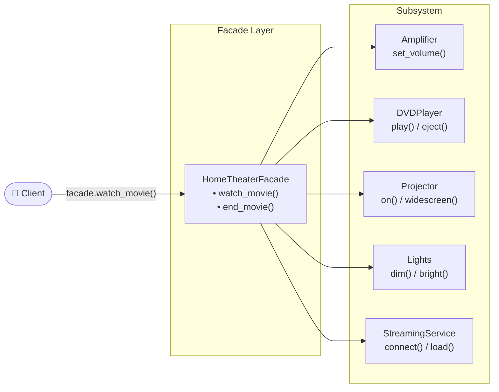

# :material-wall: Facade Pattern

!!! abstract "At a Glance"
    **Intent / Purpose:** Provide a simplified, unified interface to a complex subsystem, hiding its internal details from clients.
    **C++ Equivalent:** Wrapper class exposing a minimal API over several internal classes or a C library
    **Category:** Structural

<div class="grid cards" markdown>
- :material-lightbulb-on: **Core Concept** — One clean door into a labyrinthine building; the complexity lives behind the wall
- :material-snake: **Python Way** — Module-level functions can serve as a facade without any class; `__all__` controls the public surface
- :material-alert: **Watch Out** — A facade that exposes *too much* becomes a "god object" that still couples clients to internals
- :material-check-circle: **When to Use** — When a subsystem has many classes or steps that clients always invoke together in the same order
</div>

---

## :material-lightbulb-on: Intuition

!!! info "Core Idea"
    A hotel concierge is a perfect facade. You say "I need dinner and theatre tickets" and the concierge
    coordinates the restaurant, booking system, transport, and payment — you never interact with any of
    those subsystems directly. The concierge's desk is the facade: one point of contact, zero internal
    complexity visible to you.

    In software, a facade:

    1. **Absorbs** the orchestration logic that clients would otherwise duplicate.
    2. **Shields** clients from internal API changes; only the facade needs to change.
    3. **Does not prevent** expert clients from bypassing it and accessing subsystem classes directly
       when they need fine-grained control — this distinguishes Facade from Adapter.

!!! success "Python vs C++"
    C++ facades are always classes. In Python a **module with public functions** is a first-class facade:
    expose `turn_on()` and `turn_off()` at module level, import subsystem classes inside the module, and
    set `__all__` to hide everything else. When you *do* need a class (e.g., multiple independent home
    theater instances), a standard Python class works beautifully. Both approaches are idiomatic.

---

## :material-sitemap: Structure



---

## :material-book-open-variant: Implementation

### Home Theater Facade

```python
from __future__ import annotations
import time


# ── Subsystem classes ─────────────────────────────────────────────────────────
class Amplifier:
    def __init__(self, description: str) -> None:
        self.description = description
        self.volume = 0

    def on(self)  -> None: print(f"{self.description}: powered ON")
    def off(self) -> None: print(f"{self.description}: powered OFF")
    def set_volume(self, level: int) -> None:
        self.volume = level
        print(f"{self.description}: volume → {level}")
    def set_surround_sound(self) -> None:
        print(f"{self.description}: surround sound enabled")


class DVDPlayer:
    def __init__(self, description: str) -> None:
        self.description = description

    def on(self)              -> None: print(f"{self.description}: ON")
    def off(self)             -> None: print(f"{self.description}: OFF")
    def play(self, movie: str)-> None: print(f"{self.description}: playing '{movie}'")
    def stop(self)            -> None: print(f"{self.description}: stopped")
    def eject(self)           -> None: print(f"{self.description}: disc ejected")


class Projector:
    def on(self)         -> None: print("Projector: ON")
    def off(self)        -> None: print("Projector: OFF")
    def wide_screen_mode(self) -> None: print("Projector: widescreen (16:9)")


class TheaterLights:
    def dim(self, level: int) -> None: print(f"Lights: dimmed to {level}%")
    def on(self)              -> None: print("Lights: full brightness")


class PopcornPopper:
    def on(self)  -> None: print("Popper: ON")
    def off(self) -> None: print("Popper: OFF")
    def pop(self) -> None: print("Popper: popping corn 🍿")


# ── Facade ────────────────────────────────────────────────────────────────────
class HomeTheaterFacade:
    """Single entry point for the home theater subsystem."""

    def __init__(
        self,
        amp:      Amplifier,
        dvd:      DVDPlayer,
        projector:Projector,
        lights:   TheaterLights,
        popper:   PopcornPopper,
    ) -> None:
        self._amp      = amp
        self._dvd      = dvd
        self._proj     = projector
        self._lights   = lights
        self._popper   = popper

    def watch_movie(self, movie: str) -> None:
        print("\n— Get ready to watch a movie! —")
        self._popper.on()
        self._popper.pop()
        self._lights.dim(10)
        self._proj.on()
        self._proj.wide_screen_mode()
        self._amp.on()
        self._amp.set_surround_sound()
        self._amp.set_volume(5)
        self._dvd.on()
        self._dvd.play(movie)

    def end_movie(self) -> None:
        print("\n— Shutting down the home theater —")
        self._popper.off()
        self._lights.on()
        self._proj.off()
        self._amp.off()
        self._dvd.stop()
        self._dvd.eject()
        self._dvd.off()


# ── Usage ─────────────────────────────────────────────────────────────────────
if __name__ == "__main__":
    amp    = Amplifier("Yamaha RX-A3080")
    dvd    = DVDPlayer("Sony BDP-S6700")
    proj   = Projector()
    lights = TheaterLights()
    popper = PopcornPopper()

    theater = HomeTheaterFacade(amp, dvd, proj, lights, popper)
    theater.watch_movie("Dune: Part Two")
    # ... enjoy the movie ...
    theater.end_movie()
```

### Module-Level Facade (Pythonic — no class needed)

```python
# bank_facade.py
"""
Facade module: simple banking operations that hide validation,
persistence, and notification subsystems.
"""
from __future__ import annotations

# ── Subsystems (internal — not exported) ──────────────────────────────────────
class _Validator:
    def validate_amount(self, amount: float) -> None:
        if amount <= 0:
            raise ValueError(f"Amount must be positive, got {amount}")

    def validate_account(self, account_id: str) -> None:
        if not account_id.startswith("ACC"):
            raise ValueError(f"Invalid account ID: {account_id}")


class _Database:
    def __init__(self) -> None:
        self._balances: dict[str, float] = {"ACC001": 1000.0, "ACC002": 500.0}

    def get_balance(self, account_id: str) -> float:
        return self._balances.get(account_id, 0.0)

    def update_balance(self, account_id: str, amount: float) -> None:
        self._balances[account_id] = self._balances.get(account_id, 0.0) + amount


class _Notifier:
    def send(self, account_id: str, message: str) -> None:
        print(f"[SMS → {account_id}] {message}")


# ── Module-level singletons (hidden from callers) ─────────────────────────────
_validator = _Validator()
_db        = _Database()
_notifier  = _Notifier()


# ── Public facade functions ───────────────────────────────────────────────────
__all__ = ["deposit", "withdraw", "get_balance", "transfer"]


def deposit(account_id: str, amount: float) -> float:
    _validator.validate_account(account_id)
    _validator.validate_amount(amount)
    _db.update_balance(account_id, amount)
    new_balance = _db.get_balance(account_id)
    _notifier.send(account_id, f"Deposit £{amount:.2f}. Balance: £{new_balance:.2f}")
    return new_balance


def withdraw(account_id: str, amount: float) -> float:
    _validator.validate_account(account_id)
    _validator.validate_amount(amount)
    balance = _db.get_balance(account_id)
    if balance < amount:
        raise ValueError(f"Insufficient funds: balance £{balance:.2f}")
    _db.update_balance(account_id, -amount)
    new_balance = _db.get_balance(account_id)
    _notifier.send(account_id, f"Withdrawal £{amount:.2f}. Balance: £{new_balance:.2f}")
    return new_balance


def get_balance(account_id: str) -> float:
    _validator.validate_account(account_id)
    return _db.get_balance(account_id)


def transfer(from_id: str, to_id: str, amount: float) -> None:
    withdraw(from_id, amount)
    deposit(to_id, amount)
```

```python
# client code — clean, simple, no subsystem knowledge required
import bank_facade as bank

bank.deposit("ACC001", 250.0)
bank.transfer("ACC001", "ACC002", 100.0)
print(bank.get_balance("ACC002"))
```

### Compiler Subsystem Facade

```python
class Lexer:
    def tokenize(self, source: str) -> list[str]:
        return source.split()      # simplified

class Parser:
    def parse(self, tokens: list[str]) -> dict:
        return {"ast": tokens}     # simplified AST

class SemanticAnalyzer:
    def analyse(self, ast: dict) -> dict:
        return {**ast, "types_checked": True}

class CodeGenerator:
    def generate(self, ast: dict) -> str:
        return f"BYTECODE({ast})"

class Optimizer:
    def optimize(self, bytecode: str) -> str:
        return bytecode.replace("BYTECODE", "OPT_BYTECODE")


class Compiler:
    """Facade over the five-stage compilation pipeline."""

    def __init__(self) -> None:
        self._lexer    = Lexer()
        self._parser   = Parser()
        self._analyser = SemanticAnalyzer()
        self._codegen  = CodeGenerator()
        self._opt      = Optimizer()

    def compile(self, source: str) -> str:
        tokens   = self._lexer.tokenize(source)
        ast      = self._parser.parse(tokens)
        ast      = self._analyser.analyse(ast)
        bytecode = self._codegen.generate(ast)
        return self._opt.optimize(bytecode)


compiler = Compiler()
output   = compiler.compile("def foo(): return 42")
print(output)
```

---

## :material-alert: Common Pitfalls

!!! warning "God-Object Facade"
    A facade that exposes dozens of methods, each with many parameters, has crossed into "god object"
    territory. Keep the facade's public surface minimal — if callers need fine control, let them access
    subsystem classes directly rather than adding every knob to the facade.

!!! warning "Hiding Errors Too Deeply"
    Catching and swallowing subsystem exceptions inside the facade silently destroys debugging information.
    Re-raise with context, or define facade-level exception types:

    ```python
    try:
        self._db.update_balance(account_id, amount)
    except DatabaseError as exc:
        raise BankingError(f"Could not update account {account_id}") from exc
    ```

!!! danger "Tight Coupling via Hardcoded Subsystem Construction"
    Building subsystem objects *inside* the facade makes testing impossible without monkey-patching.
    Accept subsystem instances via `__init__` (dependency injection) so tests can pass mocks:

    ```python
    # Bad:  self._db = ProductionDatabase()
    # Good: def __init__(self, db: Database, notifier: Notifier): ...
    ```

!!! danger "Confusing Facade with Adapter"
    **Adapter** converts one interface into another (fixes incompatibility).
    **Facade** simplifies a complex subsystem (reduces complexity). If you find yourself wrapping a single
    object to make it look like a different interface, that is Adapter, not Facade.

---

## :material-help-circle: Flashcards

???+ question "What is the single most important property that makes something a Facade?"
    A Facade provides a **simplified, unified interface** to a complex subsystem while allowing expert
    clients to bypass it. If it converts one interface to another (Adapter) or adds behaviour (Decorator),
    it is not a pure Facade.

???+ question "When is a Python module a better facade than a class?"
    When you only ever need **one** facade instance (the subsystem is global/singleton). A module is a
    singleton by design in Python; module-level functions are the facade's methods, and names prefixed
    with `_` or excluded from `__all__` are the hidden subsystem. No class overhead, no instantiation.

???+ question "How does Facade differ from Proxy?"
    **Facade** hides *multiple* subsystem objects behind *one* simplified interface. **Proxy** provides
    an alternative access point for *one* object, adding control (lazy loading, access control, caching).

???+ question "How should a Facade handle subsystem exceptions?"
    Catch specific subsystem exceptions and re-raise as facade-level exceptions using `raise ... from exc`
    to preserve the original traceback. Define a custom exception hierarchy (`BankingError`,
    `InsufficientFundsError`) so callers program against the facade's contract, not the subsystem's.

---

## :material-clipboard-check: Self Test

=== "Question 1"
    You are building a video processing service backed by three subsystems: `VideoDecoder`, `FrameResizer`,
    and `VideoEncoder`. Design a `VideoConverterFacade` that exposes a single `convert(input_path, output_path, resolution)` method.

=== "Answer 1"
    ```python
    class VideoDecoder:
        def decode(self, path: str) -> list: return [f"frame from {path}"]

    class FrameResizer:
        def resize(self, frames: list, res: tuple) -> list:
            return [f"{f} @ {res}" for f in frames]

    class VideoEncoder:
        def encode(self, frames: list, path: str) -> None:
            print(f"Encoded {len(frames)} frames → {path}")


    class VideoConverterFacade:
        def __init__(
            self,
            decoder: VideoDecoder | None = None,
            resizer: FrameResizer | None = None,
            encoder: VideoEncoder | None = None,
        ) -> None:
            self._decoder = decoder or VideoDecoder()
            self._resizer = resizer or FrameResizer()
            self._encoder = encoder or VideoEncoder()

        def convert(
            self, input_path: str, output_path: str, resolution: tuple[int, int]
        ) -> None:
            frames  = self._decoder.decode(input_path)
            resized = self._resizer.resize(frames, resolution)
            self._encoder.encode(resized, output_path)


    converter = VideoConverterFacade()
    converter.convert("movie.mkv", "movie_720p.mp4", (1280, 720))
    ```

=== "Question 2"
    Why is it better to accept subsystem objects via the constructor rather than creating them inside the
    facade, and how does this relate to testability?

=== "Answer 2"
    Accepting subsystem objects via the constructor is **dependency injection**. It decouples the facade
    from concrete subsystem implementations, enabling:

    - **Unit testing**: pass mock/stub subsystems that record calls or return fixed data without I/O.
    - **Flexibility**: swap `ProductionDatabase` for `TestDatabase` or `RemoteEncoder` for `LocalEncoder`
      with zero changes to the facade.
    - **Separation of concerns**: object *creation* (who builds subsystems) is separate from object *use*
      (the facade orchestrates them).

    Default parameter values (`decoder or VideoDecoder()`) give convenience for production use while
    keeping the injection point open for tests.

---

## :material-check-circle: Summary

!!! success "Key Takeaways"
    - **Facade = one door into a complex building.** Clients call one simple method; the facade orchestrates many subsystem steps.
    - Python modules can be facades — module-level functions + `__all__` + `_`-prefixed internals give you a lightweight, zero-class facade.
    - Use **dependency injection** (pass subsystems into `__init__`) to keep the facade testable.
    - Re-raise subsystem exceptions as facade-level exceptions so callers program against a stable API.
    - Avoid the god-object trap: keep the public surface small; let expert callers access subsystems directly.
    - Facade ≠ Adapter (Adapter changes interface shape) ≠ Proxy (Proxy controls access to one object).
