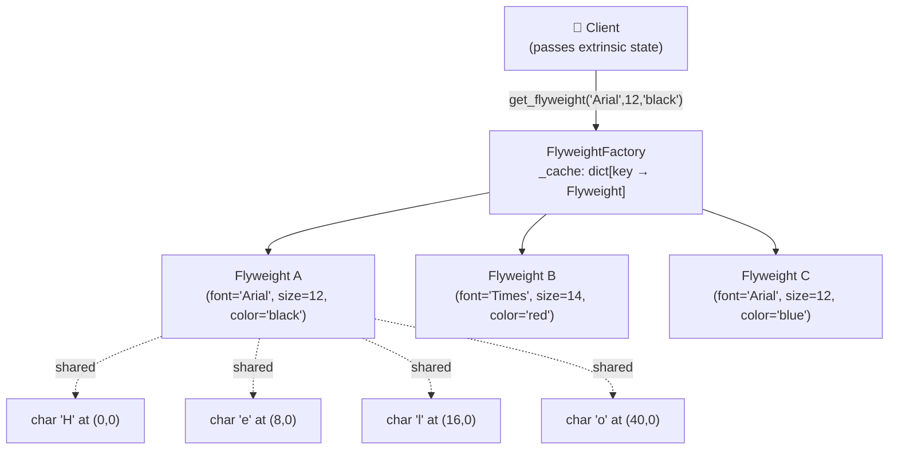

# :material-feather: Flyweight Pattern

!!! abstract "At a Glance"
    **Intent / Purpose:** Use sharing to efficiently support a large number of fine-grained objects by externalising the state that varies per-instance.
    **C++ Equivalent:** Object pool, shared `const` data with per-instance mutable context, `std::shared_ptr` to shared state
    **Category:** Structural

<div class="grid cards" markdown>
- :material-lightbulb-on: **Core Concept** — Split object state into *intrinsic* (shared, immutable) and *extrinsic* (unique, passed at use time)
- :material-snake: **Python Way** — `functools.lru_cache`, `__new__` with instance cache, or `sys.intern()` for strings give flyweight automatically
- :material-alert: **Watch Out** — Flyweight objects must be immutable; mutable shared state causes spooky cross-instance corruption
- :material-check-circle: **When to Use** — Thousands to millions of similar objects where memory or creation cost dominates
</div>

---

## :material-lightbulb-on: Intuition

!!! info "Core Idea"
    Picture a text editor displaying a million characters. If every character object stored its own copy of
    the font face, size, and colour alongside its screen position, memory usage would be enormous.
    But most characters share the same font — only their *position* differs per character.

    **Flyweight** separates:

    - **Intrinsic state** — shared, immutable data stored *inside* the flyweight object (font, colour, size)
    - **Extrinsic state** — unique, mutable context passed *by the caller* each time (position, character value)

    The factory hands out the *same* flyweight instance to all callers that need the same intrinsic state.
    A million characters might share just a handful of flyweight objects.

!!! success "Python vs C++"
    C++ programmers manage flyweight caches with `std::map` or `unordered_map` and must handle object
    lifetime manually (usually via `shared_ptr`). Python's `functools.lru_cache` turns any factory
    function into a flyweight cache with one decorator. Strings are interned automatically for short literals
    via `sys.intern()`. `__new__` overriding gives you control over instance creation at the class level.

---

## :material-sitemap: Structure



---

## :material-book-open-variant: Implementation

### Classic Flyweight — Character Rendering

```python
from __future__ import annotations
from dataclasses import dataclass
import sys


# ── Flyweight — holds only intrinsic (shared) state ───────────────────────────
@dataclass(frozen=True)   # frozen → immutable → safe to share
class CharacterStyle:
    font:   str
    size:   int
    color:  str
    bold:   bool = False
    italic: bool = False

    def render(self, char: str, x: int, y: int) -> str:
        """Extrinsic state (char, x, y) is passed at call time."""
        flags = ("B" if self.bold else "") + ("I" if self.italic else "")
        style = f"{self.font}/{self.size}pt/{self.color}" + (f"[{flags}]" if flags else "")
        return f"Render '{char}' at ({x},{y}) style={style}"


# ── Flyweight Factory — manages the shared cache ───────────────────────────────
class CharacterStyleFactory:
    _cache: dict[tuple, CharacterStyle] = {}

    @classmethod
    def get_style(
        cls,
        font:   str,
        size:   int,
        color:  str,
        bold:   bool = False,
        italic: bool = False,
    ) -> CharacterStyle:
        key = (font, size, color, bold, italic)
        if key not in cls._cache:
            cls._cache[key] = CharacterStyle(font, size, color, bold, italic)
            print(f"  [factory] Created new flyweight: {key}")
        return cls._cache[key]

    @classmethod
    def cache_size(cls) -> int:
        return len(cls._cache)


# ── Context — combines flyweight + extrinsic state ────────────────────────────
@dataclass
class CharacterContext:
    char:  str
    x:     int
    y:     int
    style: CharacterStyle   # shared flyweight reference

    def render(self) -> str:
        return self.style.render(self.char, self.x, self.y)


# ── Usage — simulate rendering 10 000 characters ─────────────────────────────
if __name__ == "__main__":
    import random
    import string

    factory = CharacterStyleFactory()
    styles  = [
        factory.get_style("Arial",   12, "black"),
        factory.get_style("Arial",   12, "blue"),
        factory.get_style("Times",   14, "black", bold=True),
        factory.get_style("Courier", 11, "grey"),
    ]

    document: list[CharacterContext] = []
    for i in range(10_000):
        document.append(CharacterContext(
            char  = random.choice(string.ascii_letters),
            x     = (i % 80) * 8,
            y     = (i // 80) * 16,
            style = random.choice(styles),
        ))

    print(f"\nDocument: {len(document):,} characters")
    print(f"Flyweight objects in cache: {factory.cache_size()}")

    # All 10 000 characters share only 4 style objects
    ids = {id(c.style) for c in document}
    print(f"Unique style object IDs: {len(ids)}")

    # Memory comparison
    style_size   = sys.getsizeof(styles[0])
    context_size = sys.getsizeof(document[0])
    print(f"\nMemory per CharacterStyle:  {style_size} B")
    print(f"Memory per CharacterContext: {context_size} B")
    print(f"Total context overhead:      {context_size * len(document):,} B")
    print(f"Shared style overhead:       {style_size * factory.cache_size()} B  (vs {style_size * len(document):,} B without sharing)")
```

### Pythonic Flyweight with `functools.lru_cache`

```python
from functools import lru_cache
from dataclasses import dataclass


@dataclass(frozen=True)
class TreeType:
    """Intrinsic (shared) data for a species of tree."""
    name:     str
    color:    str
    texture:  str

    def draw(self, x: float, y: float) -> str:
        return f"🌲 {self.name} ({self.color}/{self.texture}) at ({x:.1f},{y:.1f})"


# lru_cache turns this into a flyweight factory — same args → same instance
@lru_cache(maxsize=None)
def get_tree_type(name: str, color: str, texture: str) -> TreeType:
    print(f"  [cache miss] Creating TreeType({name!r})")
    return TreeType(name, color, texture)


@dataclass
class Tree:
    """Context object: extrinsic state + reference to shared flyweight."""
    x: float
    y: float
    tree_type: TreeType

    def draw(self) -> str:
        return self.tree_type.draw(self.x, self.y)


# ── Simulate a forest ─────────────────────────────────────────────────────────
import random

forest: list[Tree] = []
species = [
    ("Oak",   "dark-green", "rough"),
    ("Pine",  "green",      "scaly"),
    ("Birch", "light-green","smooth"),
]

for _ in range(1_000_000):
    name, color, texture = random.choice(species)
    forest.append(Tree(
        x         = random.uniform(0, 10_000),
        y         = random.uniform(0, 10_000),
        tree_type = get_tree_type(name, color, texture),   # cache hit after first 3
    ))

print(f"Forest: {len(forest):,} trees")
print(f"Unique TreeType objects: {get_tree_type.cache_info().currsize}")
```

### `__new__`-Based Flyweight (Instance-Level Cache)

```python
class Connection:
    """Flyweight connection pool — same host:port returns the same object."""

    _instances: dict[tuple[str, int], Connection] = {}

    def __new__(cls, host: str, port: int) -> Connection:
        key = (host, port)
        if key not in cls._instances:
            instance = super().__new__(cls)
            instance._host = host
            instance._port = port
            instance._initialized = False
            cls._instances[key] = instance
        return cls._instances[key]

    def __init__(self, host: str, port: int) -> None:
        if not self._initialized:          # guard against repeated __init__ on cached instance
            self._initialized = True
            print(f"[Connection] Opened {host}:{port}")

    def query(self, sql: str) -> str:
        return f"[{self._host}:{self._port}] → {sql}"


c1 = Connection("db.example.com", 5432)
c2 = Connection("db.example.com", 5432)
c3 = Connection("replica.example.com", 5432)

print(c1 is c2)   # True  — same object returned from cache
print(c1 is c3)   # False — different host
```

### String Interning — Built-In Flyweight

```python
import sys

# Python automatically interns short strings that look like identifiers
a = "hello"
b = "hello"
print(a is b)          # True in CPython (interned automatically)

# Force interning for dynamic strings:
x = sys.intern("dynamic_key_" + "suffix")
y = sys.intern("dynamic_key_" + "suffix")
print(x is y)          # True — guaranteed same object
```

---

## :material-alert: Common Pitfalls

!!! warning "Mutable Intrinsic State"
    Flyweights are **shared**. If intrinsic state is mutable, one caller's mutation silently changes the
    object for every other caller sharing it. Always make flyweight objects immutable:
    use `@dataclass(frozen=True)`, `__slots__` with no setters, or `NamedTuple`.

!!! warning "Extrinsic State Stored Inside the Flyweight"
    Never store per-usage data (position, character value, timestamp) inside the flyweight object.
    Pass it as a parameter to the operation method, or store it in a separate *Context* object that
    holds both the flyweight reference and the extrinsic state.

!!! danger "Cache Growth Without Bounds"
    A factory that caches every unique combination of arguments can itself become a memory leak if the
    key space is large. Use `functools.lru_cache(maxsize=N)` to limit cache size, or implement a
    least-recently-used eviction policy. Monitor cache size with `cache_info()`.

!!! danger "Thread Safety of the Factory Cache"
    In multithreaded code, two threads can simultaneously detect a cache miss and create two different
    instances of what should be the same flyweight. Use a `threading.Lock` around cache reads and writes:

    ```python
    import threading

    class SafeFactory:
        _cache: dict = {}
        _lock = threading.Lock()

        @classmethod
        def get(cls, key):
            with cls._lock:
                if key not in cls._cache:
                    cls._cache[key] = ExpensiveObject(key)
                return cls._cache[key]
    ```

---

## :material-help-circle: Flashcards

???+ question "What is the distinction between intrinsic and extrinsic state in the Flyweight pattern?"
    **Intrinsic state** is data that is the same across many contexts — it lives *inside* the flyweight
    and is shared. It must be immutable. **Extrinsic state** varies per usage — it is passed *to* the
    flyweight's methods at call time (or stored in a separate context object) and is never stored in the
    flyweight itself.

???+ question "How does `functools.lru_cache` implement the Flyweight pattern?"
    `lru_cache` memoises the return value of a function keyed on its arguments. When a factory function
    is decorated with `@lru_cache`, identical arguments always return the *same* object from the cache,
    exactly what a Flyweight factory does. The cache is bounded by `maxsize` to prevent unbounded growth.

???+ question "Why must flyweight objects be immutable, and how do you enforce this in Python?"
    Because they are shared among many contexts, a mutation by one caller would corrupt all others.
    Enforce immutability with `@dataclass(frozen=True)` (raises `FrozenInstanceError` on mutation),
    `NamedTuple` (tuples are immutable), or `__slots__` with properties that have no setters.

???+ question "When does Flyweight *not* help (or even hurt)?"
    When the number of distinct intrinsic-state combinations is large (close to the number of objects),
    the cache holds nearly every object and sharing never occurs. The factory overhead then wastes both
    memory and CPU. Measure before applying: Flyweight is justified when the ratio of unique flyweights
    to total objects is small (e.g., 4 tree types shared across 1M trees).

---

## :material-clipboard-check: Self Test

=== "Question 1"
    A particle system needs to render 500 000 particles. Each particle has a `(x, y, velocity_x, velocity_y)`
    that changes every frame, plus a `(shape, color, size)` that is one of only 8 combinations.
    How would you design this with Flyweight? Which fields are intrinsic and which are extrinsic?

=== "Answer 1"
    **Intrinsic (flyweight — 8 shared objects):** `shape`, `color`, `size` — shared, immutable, stored in `ParticleType`.

    **Extrinsic (per-particle — 500 000 context objects):** `x`, `y`, `velocity_x`, `velocity_y` — unique per particle, stored in `Particle`.

    ```python
    from dataclasses import dataclass
    from functools import lru_cache

    @dataclass(frozen=True)
    class ParticleType:
        shape: str
        color: str
        size:  float

        def draw(self, x: float, y: float) -> None:
            print(f"[{self.shape}/{self.color}/{self.size}] at ({x:.1f},{y:.1f})")

    @lru_cache(maxsize=None)
    def get_particle_type(shape: str, color: str, size: float) -> ParticleType:
        return ParticleType(shape, color, size)

    @dataclass
    class Particle:
        x:   float; y:  float
        vx:  float; vy: float
        ptype: ParticleType

        def update(self, dt: float) -> None:
            self.x += self.vx * dt
            self.y += self.vy * dt

        def draw(self) -> None:
            self.ptype.draw(self.x, self.y)
    ```

=== "Question 2"
    What would `cache_info()` report after creating 500 000 particles with only 8 distinct `(shape, color, size)` combinations,
    and what does each field of `CacheInfo` mean?

=== "Answer 2"
    ```
    CacheInfo(hits=499992, misses=8, maxsize=None, currsize=8)
    ```

    - **`hits=499992`** — 499 992 calls returned a cached object (no new allocation).
    - **`misses=8`** — 8 calls created a new `ParticleType` (one per unique combination).
    - **`maxsize=None`** — no eviction limit; cache grows until the process exits.
    - **`currsize=8`** — 8 unique flyweight objects are currently in the cache.

    This confirms the pattern is working: 500 000 particles share just 8 objects.

---

## :material-check-circle: Summary

!!! success "Key Takeaways"
    - **Flyweight = share the immutable, pass the mutable.** Separate intrinsic (shared) from extrinsic (per-use) state.
    - The factory cache is the heart of the pattern — it ensures identical intrinsic state maps to one object.
    - Python idioms: `@lru_cache` for function-based factories; `@dataclass(frozen=True)` for immutable flyweights; `__new__` cache for instance-level control; `sys.intern()` for strings.
    - Always enforce immutability on flyweight objects — mutable shared state is a data-corruption bug waiting to happen.
    - Measure before applying: if the number of unique flyweight states is close to the number of objects, the pattern provides no benefit.
    - Typical use cases: text rendering (character styles), particle systems, game object types, connection pools, symbol tables.
