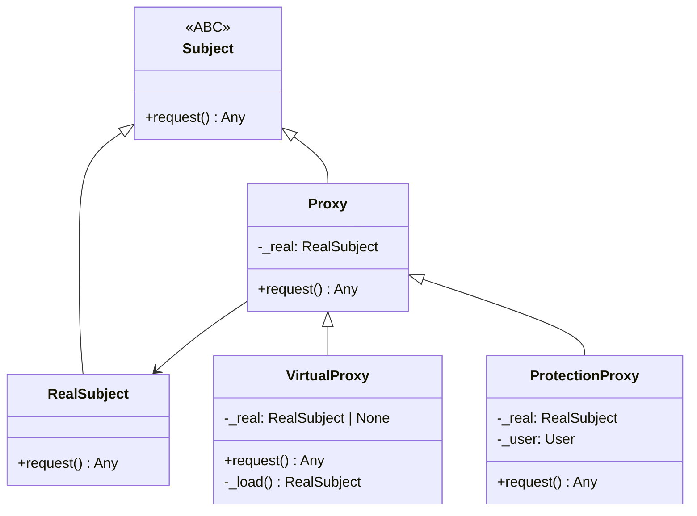

# :material-shield-half-full: Proxy Pattern

!!! abstract "At a Glance"
    **Goal:** Provide a surrogate or placeholder for another object to control access to it.
    **C++ Equivalent:** Smart pointers (`unique_ptr`, `shared_ptr`), lazy-loading wrappers.

<div class="grid cards" markdown>

- :material-lightbulb-on: **Core Concept** — Stand-in object that controls access to the real subject
- :material-snake: **Python Way** — `__getattr__` for transparent proxy; `__getattribute__` for opaque
- :material-alert: **Watch Out** — `__getattr__` is only called when normal lookup fails; `__getattribute__` intercepts everything
- :material-check-circle: **When to Use** — Lazy loading, access control, caching, remote objects

</div>

## :material-lightbulb-on: Intuition

!!! info "Core Idea"
    A Proxy controls access to a "real" object. Three main types:
    - **Virtual Proxy** — creates the real object on demand (lazy loading)
    - **Protection Proxy** — checks permissions before delegating
    - **Caching Proxy** — caches expensive operations

    Python's `__getattr__` makes transparent proxies especially easy: any attribute access that
    does not exist on the proxy is forwarded to the wrapped object.

!!! success "C++ → Python Mapping"
    | C++ | Python |
    |---|---|
    | `shared_ptr<T>` dereference | `__getattr__` delegation |
    | `operator->` overload | `__getattr__` |
    | `std::optional<T>` lazy init | Virtual proxy with `_instance = None` |
    | Access control with `std::optional<Token>` | Protection proxy |

## :material-chart-timeline: Proxy Structure



## :material-book-open-variant: Virtual Proxy (Lazy Loading)

```python
from __future__ import annotations
from typing import Any

class ExpensiveResource:
    """Simulates an expensive-to-create resource (DB connection, image, etc.)."""

    def __init__(self, resource_id: str) -> None:
        print(f"[EXPENSIVE] Loading resource {resource_id}...")
        import time; time.sleep(0.1)   # simulate load time
        self.resource_id = resource_id
        self.data = f"Data for {resource_id}"

    def get_data(self) -> str:
        return self.data

    def process(self, value: int) -> int:
        return value * 2

class LazyResourceProxy:
    """Virtual proxy — creates the real object only when first accessed."""

    def __init__(self, resource_id: str) -> None:
        self._resource_id = resource_id
        self._real: ExpensiveResource | None = None

    def _ensure_loaded(self) -> ExpensiveResource:
        if self._real is None:
            self._real = ExpensiveResource(self._resource_id)
        return self._real

    def __getattr__(self, name: str) -> Any:
        # Called when normal attribute lookup fails on the proxy
        # This transparently forwards any attribute access to the real object
        real = object.__getattribute__(self, "_ensure_loaded")()
        return getattr(real, name)

# Resource is NOT loaded yet
proxy = LazyResourceProxy("file_001")
print("Proxy created, no loading yet.")

# First access triggers loading
print(proxy.get_data())    # [EXPENSIVE] Loading... then data
print(proxy.process(21))   # 42 — no reload
```

## :material-lock: Protection Proxy

```python
from typing import Any

class DatabaseProxy:
    """Protection proxy — enforces access control."""

    def __init__(self, real_db: Any, user_role: str) -> None:
        self._db = real_db
        self._role = user_role
        self._allowed: dict[str, set[str]] = {
            "read":  {"SELECT"},
            "write": {"SELECT", "INSERT", "UPDATE"},
            "admin": {"SELECT", "INSERT", "UPDATE", "DELETE", "DROP"},
        }

    def execute(self, query: str) -> Any:
        operation = query.strip().split()[0].upper()
        allowed_ops = self._allowed.get(self._role, set())
        if operation not in allowed_ops:
            raise PermissionError(
                f"Role {self._role!r} cannot execute {operation!r}"
            )
        return self._db.execute(query)

    def __getattr__(self, name: str) -> Any:
        """Forward any other method to the real database."""
        return getattr(self._db, name)

# Usage
class FakeDB:
    def execute(self, query: str) -> str:
        return f"Result of: {query}"

db = FakeDB()
read_proxy = DatabaseProxy(db, "read")
print(read_proxy.execute("SELECT * FROM users"))   # OK
read_proxy.execute("DELETE FROM users")             # PermissionError
```

## :material-cached: Caching Proxy

```python
from typing import Any, Callable
import functools
import hashlib
import json

class CachingProxy:
    """Caching proxy — caches expensive method results."""

    def __init__(self, real: Any) -> None:
        self._real = real
        self._cache: dict[str, Any] = {}

    def __getattr__(self, name: str) -> Any:
        attr = getattr(self._real, name)
        if not callable(attr):
            return attr

        @functools.wraps(attr)
        def cached_method(*args, **kwargs):
            # Create a cache key from method name + args
            key = hashlib.md5(
                json.dumps((name, args, sorted(kwargs.items())), default=str).encode()
            ).hexdigest()
            if key not in self._cache:
                self._cache[key] = attr(*args, **kwargs)
                print(f"[CACHE MISS] {name}({args})")
            else:
                print(f"[CACHE HIT ] {name}({args})")
            return self._cache[key]

        return cached_method

class WeatherService:
    def get_weather(self, city: str) -> dict:
        print(f"  Fetching weather for {city}...")
        return {"city": city, "temp": 22, "condition": "sunny"}

proxy = CachingProxy(WeatherService())
proxy.get_weather("London")   # CACHE MISS — fetches
proxy.get_weather("London")   # CACHE HIT — from cache
proxy.get_weather("Paris")    # CACHE MISS — different city
```

## :material-alert: Common Pitfalls

!!! warning "`__getattr__` vs `__getattribute__`"
    ```python
    class Proxy:
        def __getattr__(self, name):
            # Only called if normal lookup FAILS
            # Safe — won't intercept existing attributes
            return getattr(self._real, name)

    class OpaqueProxy:
        def __getattribute__(self, name):
            # Called for EVERY attribute access — including _real, __class__, etc.
            # Very easy to cause infinite recursion!
            # Use object.__getattribute__(self, name) to access own attributes
            if name.startswith("_"):
                return object.__getattribute__(self, name)
            return getattr(object.__getattribute__(self, "_real"), name)
    ```

!!! danger "Transparent proxy breaks `isinstance`"
    ```python
    proxy = LazyResourceProxy("id")
    isinstance(proxy, ExpensiveResource)  # False!
    # If code checks isinstance, the proxy is not transparent enough.
    # Fix: register with ABC or use __class__ spoofing (advanced, rarely needed).
    ```

## :material-help-circle: Flashcards

???+ question "What is the difference between a Proxy and a Decorator (structural)?"
    Both wrap another object and forward calls. The difference is **intent**:
    **Proxy** controls access to the real subject (creation, permissions, caching, remoting).
    **Decorator** adds new behaviour to the subject without changing how it is accessed.
    A Proxy manages the lifecycle of the wrapped object; a Decorator enhances it.

???+ question "How does Python's `__getattr__` enable transparent proxies?"
    `__getattr__` is called when normal attribute lookup fails. If the proxy class does not
    have an attribute, Python falls through to `__getattr__`, which can forward to the real
    object. This means the proxy exposes the same interface as the real object automatically,
    without explicitly delegating each method.

???+ question "What is a remote proxy and how is it implemented in Python?"
    A remote proxy provides a local interface to a remote object. The proxy serialises
    method calls, sends them over the network, and deserialises the response.
    Python's `xmlrpc.client.ServerProxy` is an example. Also: gRPC stubs, Pyro4's proxies.
    The interface is identical to the real object; the proxy handles all network communication.

???+ question "What is the difference between `__getattr__` and `@property`?"
    `@property` defines specific computed attributes with explicit names at class-definition time.
    `__getattr__` is a catch-all fallback for any undefined attribute — dynamic and flexible.
    Use `@property` for well-known computed attributes. Use `__getattr__` for forwarding to a
    wrapped object or for dynamic attribute generation.

## :material-clipboard-check: Self Test

=== "Question 1"
    Implement a `ReadOnlyProxy` that prevents any attribute assignment on the wrapped object.

=== "Answer 1"
    ```python
    class ReadOnlyProxy:
        def __init__(self, real):
            object.__setattr__(self, "_real", real)

        def __getattr__(self, name):
            return getattr(object.__getattribute__(self, "_real"), name)

        def __setattr__(self, name, value):
            raise AttributeError("This proxy is read-only")

        def __delattr__(self, name):
            raise AttributeError("This proxy is read-only")

    class Config:
        host = "localhost"
        port = 8080

    cfg = ReadOnlyProxy(Config())
    print(cfg.host)    # "localhost"
    cfg.host = "other" # AttributeError: This proxy is read-only
    ```

=== "Question 2"
    How would you implement a proxy that logs all method calls and their duration?

=== "Answer 2"
    ```python
    import time, functools

    class LoggingProxy:
        def __init__(self, real, logger=print):
            object.__setattr__(self, "_real", real)
            object.__setattr__(self, "_logger", logger)

        def __getattr__(self, name):
            real = object.__getattribute__(self, "_real")
            log = object.__getattribute__(self, "_logger")
            attr = getattr(real, name)
            if not callable(attr):
                return attr

            @functools.wraps(attr)
            def logged(*args, **kwargs):
                start = time.perf_counter()
                try:
                    result = attr(*args, **kwargs)
                    elapsed = time.perf_counter() - start
                    log(f"[OK ] {name}() → {elapsed:.4f}s")
                    return result
                except Exception as e:
                    elapsed = time.perf_counter() - start
                    log(f"[ERR] {name}() raised {type(e).__name__} ({elapsed:.4f}s)")
                    raise
            return logged
    ```

## :material-check-circle: Summary

!!! success "Key Takeaways"
    - Proxy controls access to a real object: lazy creation, access control, caching, or remoting.
    - `__getattr__` enables transparent delegation — only called when normal lookup fails.
    - Virtual Proxy delays expensive creation until first use.
    - Protection Proxy enforces permissions before forwarding calls.
    - Caching Proxy remembers results to avoid redundant expensive operations.
    - Use `object.__getattribute__(self, "_real")` inside `__getattr__` to avoid infinite recursion.
